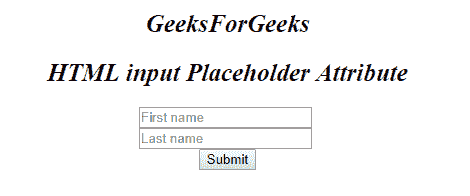

# HTML | <input>占位符属性

> 原文:[https://www . geesforgeks . org/html-input-placeholder-attribute/](https://www.geeksforgeeks.org/html-input-placeholder-attribute/)

HTML 中的 **<输入>占位符属性**用于*在输入元素*中指定用户输入之前要显示的期望值。

**语法:**

```html
<input placeholder="text"> 
```

**属性值:**该属性包含单个值**文本**，该文本指定了描述输入字段预期值的简短提示。

**示例:**本示例说明了在 **<输入>** 元素时占位符属性的使用。

```html
<!DOCTYPE html>
<html>

<body>
    <center>
        <h1 style="font-size:25px;font-style:italic;">
          GeeksForGeeks
      </h1>
        <h2 style="font-size:25px;font-style:italic;">
          HTML input Placeholder Attribute
      </h2>

        <form action=" ">
            <input type="text"
                   name="fname"
                   placeholder="First name">
            <br>
            <input type="text"
                   name="lname" 
                   placeholder="Last name">
            <br>
            <input type="submit" 
                   value="Submit">
        </form>
  </center>
</body>

</html>
```

**输出:**


**支持的浏览器:**以下是 **HTML <输入>占位符属性**支持的浏览器:

*   谷歌 Chrome
*   微软公司出品的 web 浏览器
*   火狐浏览器
*   歌剧
*   旅行队