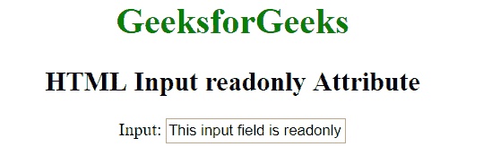

# HTML |输入只读属性

> 原文:[https://www . geesforgeks . org/html-input-readonly-attribute/](https://www.geeksforgeeks.org/html-input-readonly-attribute/)

HTML 中<输入>元素的**只读**属性用于指定输入字段为只读。如果一个输入是只读的，那么它的内容不能改变，但可以复制和突出显示。它是一个布尔属性。

**语法:**

```html
<input readonly>
```

**示例:**本示例使用 HTML <输入>只读属性。

```html
<!DOCTYPE html> 
<html> 

<head> 
    <title>HTML Input readonly Attribute</title> 
</head> 

<body style = "text-align:center">     
    <h1 style = "color: green;">
        GeeksforGeeks
    </h1> 

    <h2>
        HTML Input readonly Attribute
    </h2> 

    <label>Input: 

        <!--A readonly input-->
        <input type="text" name="value" value = 
            "This input field is readonly" readonly> 
    </label> 
</body> 

</html>                    
```

**输出:**


**支持的浏览器:**输入>只读属性支持的浏览器如下:

*   苹果 Safari 1.0
*   谷歌 Chrome 1.0
*   Firefox 1.0
*   Opera 1.0
*   Internet Explorer 6.0