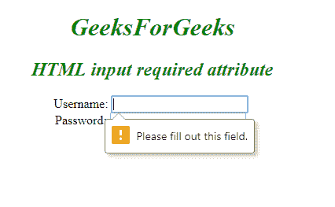
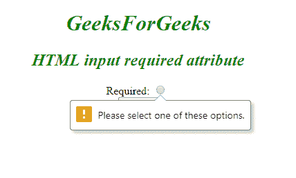

# HTML | <input>必填属性

> 原文:[https://www . geesforgeks . org/html-input-required-attribute/](https://www.geeksforgeeks.org/html-input-required-attribute/)

**HTML 必需属性**是一个布尔属性，用于指定提交表单前必须填写输入元素。
该属性适用于其他类型的输入，如单选、复选框、数字、文本等。
**语法:**

```html
<input required> 
```

**示例-1:** 该示例说明了输入元素中所需属性的使用。

## 超文本标记语言

```html
<!DOCTYPE html>
<html>

<head>
    <title>
      required Attribute
  </title>
    <style>
        h1,
        h2 {
            color: green;
            font-style: italic;
        }

        body {
            text-align: center;
        }
    </style>
</head>

<body>
    <h1>GeeksForGeeks</h1>
    <h2>
      HTML input required attribute
  </h2>
    <form action="">
        Username:
        <input type="text"
               name="username"
               required>
        <br> Password:
        <input type="password"
               name="password">
        <br>
        <input type="submit">
    </form>
</body>

</html>
```

**输出:**



**示例-2:** 该示例说明了输入元素中所需属性的使用。

## 超文本标记语言

```html
<!DOCTYPE html>
<html>

<head>
    <title>
      required Attribute
  </title>
    <style>
        h1,
        h2 {
            color: green;
            font-style: italic;
        }

        body {
            text-align: center;
        }
    </style>
</head>

<body>
    <h1>GeeksForGeeks</h1>
    <h2>
      HTML input required attribute
  </h2>
    <form action="">
        Required:
        <input type="radio"
               name="radiocheck"
               required>
        <br>
        <input type="submit">
    </form>
</body>

</html>
```

**输出:**



**支持的浏览器:****HTML 输入所需属性**支持的浏览器如下:

*   谷歌 Chrome
*   微软公司出品的 web 浏览器
*   火狐浏览器
*   歌剧
*   旅行队