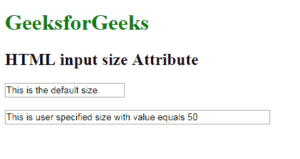

# HTML | <input>大小属性

> 原文:[https://www.geeksforgeeks.org/html-input-size-attribute/](https://www.geeksforgeeks.org/html-input-size-attribute/)

**HTML <输入>大小属性**用于*指定一个<输入>元素*的字符可见宽度。它可以处理许多输入字段，如文本、搜索、电话、网址、电子邮件和密码。

**语法:**

```html
<input size="number"> 
```

**属性值:**包含以字符数表示的输入字段宽度的数值。

**示例:**

```html
<!DOCTYPE html>
<html>

<head>
    <title>HTML input size Attribute</title>
</head>

<body>
    <h1 style="color: green;"> 
            GeeksforGeeks 
        </h1>

    <h2> 
            HTML input size Attribute 
        </h2>

    <input type="text" 
           value="This is the default size.">
    <br>
    <br>
    <input type="text" 
           size="50"
           value= "This is user specified size 
     with value equals 50">
</body>

</html>
```

**输出:**


**支持的浏览器:****HTML 输入大小属性**支持的浏览器如下:

*   谷歌 Chrome
*   微软公司出品的 web 浏览器
*   火狐浏览器
*   歌剧
*   旅行队