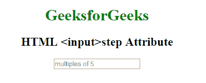

# HTML |步骤属性

> 原文:[https://www.geeksforgeeks.org/html-input-step-attribute/](https://www.geeksforgeeks.org/html-input-step-attribute/)

HTML 中的 **HTML <输入>步长属性**用于*设置* [*<输入>*](https://www.geeksforgeeks.org/html-input-tag/) *元素的离散步长。数字输入的默认步进值为 1* 。
**用法:**适用于以下输入类型:

*   数字
*   范围
*   日期
*   日期时间-本地
*   月
*   时间
*   周

**语法:**

```html
<input step = "value"> 
```

**属性值:**它包含一个值，即**数字**，指定数字字段的合法数字间隔。它的默认值是 1。

**示例:**本示例说明了在 **<中使用 step 属性输入>** 元素。

## 超文本标记语言

```html
<!DOCTYPE html>
<html>

<head>
    <title>
      HTML input step Attribute
  </title>
</head>

<body>
  <center>
    <h1 style="color: green;">
            GeeksforGeeks
        </h1>

    <h2>
            HTML <input>step Attribute
        </h2>

    <input type="number"
           name="points"
           step="5"
           placeholder="multiples of 5">

  </center>
</body>

</html>
```

**输出:**



**支持的浏览器:**输入>步属性的 **<支持的浏览器如下:**

*   谷歌 Chrome 6.0
*   Internet Explorer 10.0
*   Firefox 16.0
*   苹果 Safari 5.0
*   歌剧 10.6