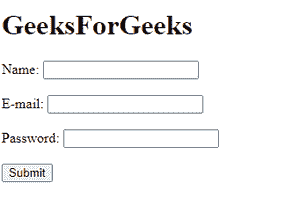
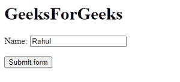

# HTML 输入标签

> 原文:[https://www.geeksforgeeks.org/html-input-tag/](https://www.geeksforgeeks.org/html-input-tag/)

在 HTML 中，可以使用*指定**输入**字段，用户可以在其中输入数据*。输入标签在 **<表单>** 元素中用于声明允许用户输入数据的输入控件。根据属性类型，输入字段可以是各种类型。输入标签是一个只包含属性的空元素。为输入元素定义标签时，可以使用 **<标签>** 。

#### 句法

```html
<input type = "value" .... />
```

#### **属性:**

*   [**类型**](https://www.geeksforgeeks.org/html-input-type-attribute) **:** 类型属性用于指定输入元素的类型。它的默认值是文本。
*   [**值**](https://www.geeksforgeeks.org/html-value-attribute) **:** 值属性用于指定输入元素的值。
*   [**占位符**](https://www.geeksforgeeks.org/html-placeholder-attribute) **:** 占位符属性用于指定描述输入字段预期值的提示。
*   [**名称**](https://www.geeksforgeeks.org/html-input-name-attribute) **:** 名称属性用于指定输入元素的名称。
*   [**alt**](https://www.geeksforgeeks.org/html-input-alt-attribute)**:**alt 属性用于在用户无法查看图像的情况下，为用户提供替代文本。
*   [**自动对焦**](https://www.geeksforgeeks.org/html-input-autofocus-attribute/) **:** 自动对焦属性指定页面加载时元素应自动对焦。
*   [**勾选**](https://www.geeksforgeeks.org/html-inputchecked-attribute/) **:** 勾选的属性指定页面加载时要预选(勾选)一个元素。选中的属性可以与<输入类型=“复选框”>和<输入类型=“单选”>一起使用。
*   [**禁用**](https://www.geeksforgeeks.org/html-input-disabled-attribute/) **:** 禁用属性指定元素应禁用。可以设置禁用属性，以防止用户使用<输入>元素，直到满足某些其他条件。
*   [**表单**](https://www.geeksforgeeks.org/html-input-form-attribute/) **:** 表单属性用于指定<输入的>元素所属的一个或多个表单。

*   [**max**](https://www.geeksforgeeks.org/html-inputmax-attribute/)**:**max 属性用于指定<输入>元素的最大值。
*   [**必选**](https://www.geeksforgeeks.org/html-input-required-attribute) **:** 必选属性指定提交表单前必须填写输入字段。

*   [**【只读】**](https://www.geeksforgeeks.org/html-input-readonly-attribute/) **:** 只读属性指定输入字段为只读。不能修改只读输入字段。表单仍将提交只读的输入字段，但不会提交禁用的输入字段。

*   [**接受**](https://www.geeksforgeeks.org/html-input-accept-attribute/) **:** 此属性用于指定服务器接受的文件类型。
*   [**对齐**](https://www.geeksforgeeks.org/html-input-align-attribute/) **:** 该属性用于指定图像输入的对齐方式。
*   [**自动完成**](https://www.geeksforgeeks.org/html-input-autocomplete-attribute/) **:** 该属性用于指定一个<输入>元素是否应该启用自动完成。
*   [**dirname**](https://www.geeksforgeeks.org/html-input-dirname-attribute/) **:此属性用于指定提交的文字方向。**
*   [**表单**](https://www.geeksforgeeks.org/html-input-formaction-attribute/) **:** 此属性用于指定表单提交时将处理输入控件的文件的 URL(对于 type="submit "和 type="image ")
*   [**表单类型**](https://www.geeksforgeeks.org/html-input-formenctype-attribute/) **:** 该属性用于指定表单数据在提交到服务器时应该如何编码(对于 type="submit "和 type="image ")
*   [**form method**](https://www.geeksforgeeks.org/html-input-formmethod-attribute/)**:**此属性用于定义向动作 URL 发送数据的 HTTP 方法(对于 type="submit "和 type="image ")
*   [**表单模板**](https://www.geeksforgeeks.org/html-input-formnovalidate-attribute/#:~:text=The%20HTML%20formnovalidate%20Attribute,type%3D%E2%80%9Dsubmit%E2%80%9D%3E.) **:** 此属性用于定义表单元素在提交时不应被验证
*   [**表单目标**](https://www.geeksforgeeks.org/html-input-formtarget-attribute/#:~:text=Related%20Articles&text=The%20HTML%20formtarget%20attribute,attribute%20of%20element.) **:** 该属性用于指定在提交表单后接收到的响应的显示位置(对于 type="submit "和 type="image ")
*   [**高度**](https://www.geeksforgeeks.org/html-input-height-attribute/#:~:text=The%20HTML%20height%20Attribute,input%20type%3D%E2%80%9Dimage%E2%80%9D.&text=Attribute%20Values%3A%20It%20contains%20the,height%20of%20the%20input%20Element.) **:** 该属性用于指定输入>元素的高度(仅适用于 type="image ")
*   [**列表**](https://www.geeksforgeeks.org/html-input-list-attribute/#:~:text=The%20HTML%20list%20Attribute,element%20to%20suggest%20the%20user.&text=Attribute%20Values%3A,up%20with%20the%20input%20element.) **:** 该属性用于引用包含<输入>元素的预定义选项的<数据列表>元素
*   [**最大长度**](https://www.geeksforgeeks.org/html-input-maxlength-attribute/#:~:text=The%20maxlength%20attribute%20is,into%20the%20element.&text=Attribute%20Value%3A,Its%20default%20value%20is%20524288.) **:** 该属性用于指定<输入>元素中允许的最大字符数
*   [**min**](https://www.geeksforgeeks.org/html-input-min-attribute/#:~:text=HTML%20%7C%20min%20Attribute,-Last%20Updated%20%3A%2023&text=The%20HTML%20min%20Attribute%20is,%2C%20month%2C%20time%20and%20week.) **:** 该属性用于指定<输入>元素的最小值
*   [**多个**](https://www.geeksforgeeks.org/html-input-multiple-attribute/#:~:text=HTML%20%7C%20multiple%20Attribute,-Last%20Updated%20%3A%2028&text=The%20HTML%20multiple%20Attribute,as%20email%2C%20file%2C%20etc.) **:** 该属性用于指定用户可以在一个<输入>元素中输入多个值
*   [**模式**](https://www.geeksforgeeks.org/html-input-pattern-attribute/#:~:text=The%20HTML%20pattern%20attribute,pattern%20for%20helping%20the%20user.) **:** 该属性用于指定一个正则表达式，用于检查<输入的>元素的值
*   [**大小**](https://www.geeksforgeeks.org/html-input-size-attribute/) **:** 该属性用于指定输入<元素的宽度，以字符为单位
*   [**src**](https://www.geeksforgeeks.org/html-input-src-attribute/#:~:text=HTML%20%7C%20src%20Attribute,-Last%20Updated%20%3A%2010&text=The%20HTML%20src%20Attribute,type%3D%E2%80%9Dimage%E2%80%9D%3E.&text=Attribute%20Values%3A%20It%20contains%20a,the%20link%20of%20source%20image.) **:** 此属性用于指定用作提交按钮的图像的 URL(仅适用于 type="image ")
*   [**步骤**](https://www.geeksforgeeks.org/html-input-step-attribute/) **:** 该属性用于指定输入字段的合法数字间隔
*   [**宽度**](https://www.geeksforgeeks.org/html-input-width-attribute/#:~:text=The%20HTML%20width%20Attribute,input%20type%3D%E2%80%9Dimage%E2%80%9D.&text=Attribute%20Values%3A%20It%20contains%20the,width%20of%20the%20input%20Element.) **:** 该属性用于指定输入<元素的宽度(仅适用于 type="image ")

**例-1:** 使用**“型”**属性。

## 超文本标记语言

```html
<!DOCTYPE html>
<html>

<body>
    <h1>GeeksForGeeks</h1>

    <form>
        <label>Name:</label>
        <input type="text" name="name" value="">
        <br><br>

        <label>E-mail:</label>
        <input type="email" name="emailaddress">
        <br><br>

        <label>Password: </label>
        <input type="password" name="password">
        <br><br>

        <input type="submit">

    </form>
</body>

</html>
```

**输出:**



**示例-2:** 使用**“值”**属性。

## 超文本标记语言

```html
<!DOCTYPE html>
<html>

<body>
    <h1>GeeksForGeeks</h1>
    <form>

        <label> Name: </label>
        <input type="text" name="name1" value="Rahul">
        <br>
        <br>
        <input type="submit" value="Submit form">

    </form>
</body>

</html>
```

**输出:**



**支持的浏览器:**

*   谷歌 Chrome
*   微软公司出品的 web 浏览器
*   火狐浏览器
*   歌剧
*   旅行队