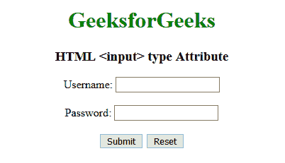

# HTML |类型属性

> 原文:[https://www.geeksforgeeks.org/html-input-type-attribute/](https://www.geeksforgeeks.org/html-input-type-attribute/)

HTML <input>类型属性用于指定要显示的<input>元素的类型。<input>类型属性的默认类型是文本。
**语法:**

```html
<input type="value">
```

**属性值:**

*   [**按钮**](https://www.geeksforgeeks.org/html-input-type-button/) **:** 用于定义文档中可点击的按钮。它主要与 JavaScript 一起使用来激活脚本。
*   [**复选框**](https://www.geeksforgeeks.org/html-input-typecheckbox/) **:用于定义复选框字段。该复选框显示为一个方形框，当它被激活时会被勾选。它允许用户在所有有限的选项中选择一个或多个选项。**
*   [**颜色**](https://www.geeksforgeeks.org/html-input-typecolor/) **:用于定义拾色器。该值应该是七个字符的十六进制表示法。它的默认值是#000000(黑色)。**
*   [](https://www.geeksforgeeks.org/html-input-typedate/)****:**用于定义日期选择器或控制字段。该值将是年、月和日。**
*   **[**邮箱**](https://www.geeksforgeeks.org/html-input-typeemail/) **:** 用于定义邮箱地址的字段。自动验证输入的电子邮件 id，以检查电子邮件 id 的格式是否正确。**
*   **[**文件**](https://www.geeksforgeeks.org/html-input-typefile/) **:** 用于指定文件选择字段，并添加按钮选择要上传到表单的文件。**
*   **[**隐藏**](https://www.geeksforgeeks.org/html-input-typehidden/) **:** 用于定义一个输入隐藏字段。隐藏字段还包括用户在提交表单时无法看到或修改的数据。隐藏字段仅存储提交表单时需要更新的数据库记录。**
*   **[**图像:**](https://www.geeksforgeeks.org/html-input-typeimage/) 用于定义图像为提交按钮。**
*   **[**【月】**](https://www.geeksforgeeks.org/html-input-typemonth/) **:用于指定月、年字段的控制。该值的格式必须为“YYYY-MM”。****
*   **[**数字**](https://www.geeksforgeeks.org/html-input-typenumber/) **:用于指定输入数字的输入字段。****
*   **[**密码**](https://www.geeksforgeeks.org/html-input-typepassword/) **:用于指定输入标签的密码字段。密码应通过 HTTPS 页面提供，因为它包含用户的敏感信息。****
*   **[**单选**](https://www.geeksforgeeks.org/html-input-typeradio/) **:用于定义单选按钮。单选按钮用于让用户从预定义选项列表中选择一个选项。单选按钮输入控件是通过使用“input”元素创建的，该元素的类型属性的值为“Radio”。****
*   **[**范围**](https://www.geeksforgeeks.org/html-input-typerange/) **:** 用于定义对用户输入的数字的控制。它可以对用户将要输入的不重要的数字或值设置限制。它的默认值范围从 0 到 100。**
*   **[**【复位】**](https://www.geeksforgeeks.org/html-input-typereset/) **:用于定义复位按钮。重置按钮用于将所有表单值重置为其初始值。****
*   **[**搜索**](https://www.geeksforgeeks.org/html-input-typesearch/) **:** 用于定义输入搜索字符串的文本字段。**
*   **[**提交**](https://www.geeksforgeeks.org/html-input-typesubmit/) **:用于定义提交按钮。它用于将所有用户值提交给表单处理程序。表单处理程序是一个服务器页面，它激活一个脚本来处理所有的输入值。****
*   **[**电话**](https://www.geeksforgeeks.org/html-input-typetel/) **:** 用于定义输入用户电话号码的字段。**
*   **[**文本**](https://www.geeksforgeeks.org/html-input-typetext/) **:** 用于定义单行文本字段。文本字段的默认宽度为 20 个字符。**
*   **[](https://www.geeksforgeeks.org/html-input-typetime/)****:**用于指定进入时间控制字段。****
*   ****[**网址**](https://www.geeksforgeeks.org/html-input-typeurl/) **:** 用于定义输入网址的字段。在提交表单之前，会自动验证该输入值。****
*   ****[**周**](https://www.geeksforgeeks.org/html-input-typeweek/) **:** 用于定义一周和一年控制字段。****

******例:****** 

## ****超文本标记语言****

```html
**<!DOCTYPE html>
<html>

<head>
    <title>HTML Input type = "Date" </title>
    <style>
        h1 {
            color: green;
        }

        h2 {
            font-family: Impact;
        }

        body {
            text-align: center;
        }
    </style>
</head>

<body>

    <h1>GeeksforGeeks</h1>
    <h2>HTML <input type="date"></h2>

    <input type="date"
        id="test"
        value="2019-07-02T25:32Z">

</body>

</html>**
```

******输出:****** 

********

******支持的浏览器:**HTML<输入>类型属性支持的浏览器如下:**** 

*   ****谷歌 Chrome****
*   ****微软公司出品的 web 浏览器****
*   ****火狐浏览器****
*   ****旅行队****
*   ****歌剧****