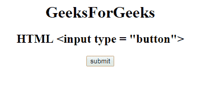

# HTML | <input type="button">

> 原文:[https://www.geeksforgeeks.org/html-input-type-button/](https://www.geeksforgeeks.org/html-input-type-button/)

**HTML <输入类型=“按钮”>** 用于在文档中定义一个*可点击按钮。它主要与 Javascript 一起使用来激活脚本。*

**语法:**

```html
<input type="button"> 
```

**示例:**

```html
<html>

<head>
    <title>
        HTML input type="button"
    </title>
</head>

<body style="text-align:center;">
    <h1>GeeksForGeeks</h1>
    <h2>HTML <input type = "button"></h2>
    <input type="button"
           onclick="send()" 
           value="submit">
    <script>
        function send() {
            alert("Hello World");
        }
    </script>
</body>

</html>
```

**输出:**


**支持的浏览器:**

*   谷歌 Chrome 1.0
*   Firefox 1.0
*   边缘
*   歌剧
*   苹果 Safari 1.0