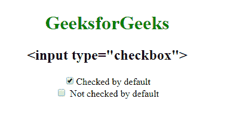

# HTML | <input type="”checkbox”">

> 原文:[https://www.geeksforgeeks.org/html-input-typecheckbox/](https://www.geeksforgeeks.org/html-input-typecheckbox/)

**HTML <输入类型=“复选框”>** 用于定义复选框字段。该复选框显示为一个方形框，当它被激活时会被勾选。它允许用户在所有有限的选项中选择一个或多个选项。

**语法:**

```html
<input type="checkbox"> 
```

**示例:**

```html
<!DOCTYPE html>
<html>

<head>
    <title>
        Input type = "checkbox"
    </title>
</head>

<body style="text-align: center;">

    <h1 style="color:green;"> 
            GeeksforGeeks 
        </h1>

    <h2><input type="checkbox"></h2>

    <form>

        <!-- Below input elements have attribute 
                checked -->
        <input type="checkbox"
               name="check"
               id="GFG" 
               value="1" 
               checked>
      Checked by default
        <br>
        <input type="checkbox" 
               name="check"
               value="2"> 
      Not checked by default
        <br>
    </form>
    <br> 
 </body>

</html>
```

**输出:**


**支持的浏览器:**

*   谷歌 Chrome
*   火狐浏览器
*   边缘
*   歌剧
*   苹果 Safari