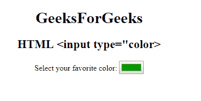

# HTML | <input type="”color”">

> 原文:[https://www.geeksforgeeks.org/html-input-typecolor/](https://www.geeksforgeeks.org/html-input-typecolor/)

**HTML <输入类型=“颜色”>** 用于*定义颜色选择器*。该值应该是七个字符的十六进制表示法。默认值为 **#000000** (黑色)。

**语法:**

```html
<input type="color"> 
```

**示例:**

```html
<!DOCTYPE html>
<html>

<head>
    <title>
        HTML DOM Input Type = "color"
    </title>
</head>

<body style="text-align:center;">
    <h1> 
        GeeksForGeeks 
    </h1>
    <h2> 
        HTML <input type="color> 
    </h2>

    <p>
        Select your favorite color:
        <input type="color" 
               value="#009900" 
               id="color">
    </p>
</body>

</html>
```

**输出:**


**支持的浏览器:**

*   谷歌 Chrome 20.0
*   Firefox 29.0
*   Edge 38.0
*   歌剧 11.1
*   苹果 Safari 10.1