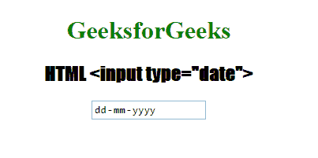

# HTML | <input type="”date”">

> 原文:[https://www.geeksforgeeks.org/html-input-typedate/](https://www.geeksforgeeks.org/html-input-typedate/)

**HTML <输入类型=“日期”>** 用于定义*日期选择器或控制字段*。该值将是年、月和日。
**语法:**

```html
<input type="date"> 
```

**例:**

## 超文本标记语言

```html
<!DOCTYPE html>
<html>

<head>
    <title>HTML Input type = "Date" </title>
    <style>
        h1 {
            color: green;
        }

        h2 {
            font-family: Impact;
        }

        body {
            text-align: center;
        }
    </style>
</head>

<body>

    <h1>GeeksforGeeks</h1>
    <h2>HTML <input type="date"></h2>

    <input type="date"
           id="test"
           value="2019-07-02T25:32Z">

</body>

</html>
```

**输出:**



**支持的浏览器:**

*   谷歌 Chrome 20.0
*   Firefox 57.0
*   Edge 12.0
*   歌剧 10.1
*   苹果 Safari 14.1