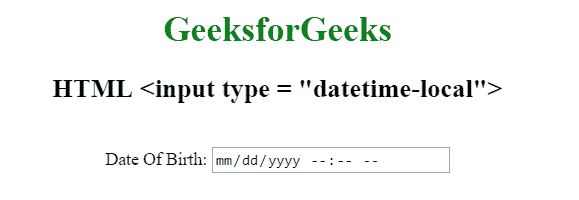

# HTML | <input type="”datetime-local”">

> 原文:[https://www . geesforgeks . org/html-input-type datetime-local/](https://www.geeksforgeeks.org/html-input-typedatetime-local/)

**HTML <输入类型=“日期时间-本地”>** 用于定义日期和时间控制。该值必须包括年、月、日和时间。

**语法:**

```html
<input type="datetime-local">
```

**示例:**

```html
<!DOCTYPE html> 
<html> 

<head> 
    <title>
        HTML input type datetime-local
    </title>

    <style> 
        h1 { 
            color: green; 
        } 

        body { 
            text-align: center; 
        } 
    </style> 
</head> 

<body> 

    <h1>GeeksforGeeks</h1> 

    <h2> HTML <input type = "datetime-local"></h2> 

    <br> 

    Date Of Birth: 
    <input type="datetime-local" id="Test_DatetimeLocal"> 
</body> 

</html>
```

**输出:**


**支持的浏览器:**输入类型=“datetime-local”>支持的浏览器如下:

*   谷歌 Chrome 20.0
*   Internet Explorer 13.0
*   歌剧 10.1