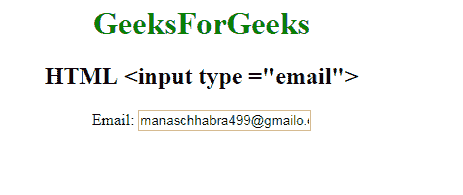

# HTML | <input type="”email”">

> 哎哎哎:# t0]https://www . geeksforgeeks . org/html-input-type email/

**HTML <输入类型=“电子邮件”>** 用于定义电子邮件地址字段。自动验证输入的电子邮件 id，以检查电子邮件 id 的格式是否正确。

**语法**

```html
<input type="email"> 
```

**示例:**

```html
<!DOCTYPE html>
<html>
    <head>
        <title>
            HTML input type email
        </title>
    </head>

    <body style="text-align:center;">

        <h1 style="color:green;">
            GeeksForGeeks
        </h1>

        <h2>HTML <input type ="email"></h2>

        <form>
            Email: <input type ="email" 
                value="manaschhabra499@gmailo.com">
        </form>
    </body>
</html>                    
```

**输出:**


**支持的浏览器:**输入 type="email" > 支持的浏览器如下:

*   谷歌 Chrome 5.0
*   Internet Explorer 10.0
*   Firefox 4.0
*   Safari 5.0
*   歌剧 10.1