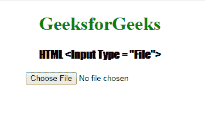

# HTML | <input type="”file”">

> 原文:[https://www.geeksforgeeks.org/html-input-typefile/](https://www.geeksforgeeks.org/html-input-typefile/)

**HTML <输入类型=“文件”>** 用于指定文件选择字段，并添加按钮选择要上传到表单的文件。

**语法:**

```html
<input type="file"> 
```

**示例:**

```html
<!DOCTYPE html> 
<html> 

<head> 
    <title> 
        HTML input type file
    </title> 

    <style> 
        h1 { 
            color: green; 
        } 
        h3 { 
            font-family: Impact; 
        } 
        body { 
            text-align: center; 
        } 
    </style> 
</head> 

<body> 
    <h1> 
        GeeksforGeeks 
    </h1> 

    <h3> 
        HTML <Input Type = "File"> 
    </h3> 

    <input type="file" id="myFile"> 

    <p id="submit_text"></p>
</body> 

</html>                    
```

**输出:**


**支持的浏览器:**输入 type="file" > 支持的浏览器如下:

*   谷歌 Chrome 1.0
*   微软公司出品的 web 浏览器
*   Firefox 1.0
*   Safari 1.0
*   Opera 1.0