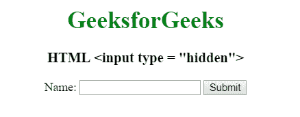

# HTML <input type="”hidden”">

> 原文:[https://www.geeksforgeeks.org/html-input-typehidden/](https://www.geeksforgeeks.org/html-input-typehidden/)

**HTML <输入类型=“隐藏”>** 用于定义输入隐藏字段。隐藏字段还包括用户在提交表单时无法看到或修改的数据。隐藏字段仅存储提交表单时需要更新的数据库记录。

**语法:**

```html
<input type="hidden"> 
```

**示例:**

```html
<!DOCTYPE html> 
<html> 

<head> 
    <title> 
        HTML input type hidden
    </title> 

    <style> 
        h1 { 
            color: green; 
        } 
        body { 
            text-align: center; 
        } 
    </style> 
</head> 

<body> 
    <h1> 
        GeeksforGeeks 
    </h1> 

    <h3> 
        HTML <input type = "hidden"> 
    </h3> 

    <form action="#">
        <input type="hidden" id="myFile" value="1234">

        Name: <input type="text">

        <input type="submit" value="Submit">
    </form>
</body> 

</html>                                    
```

**输出:**


**支持的浏览器:**输入 type="hidden" > 支持的浏览器如下:

*   谷歌 Chrome 1.0
*   微软公司出品的 web 浏览器
*   Firefox 1.0
*   Safari 1.0
*   Opera 1.0