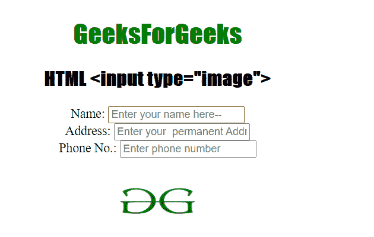
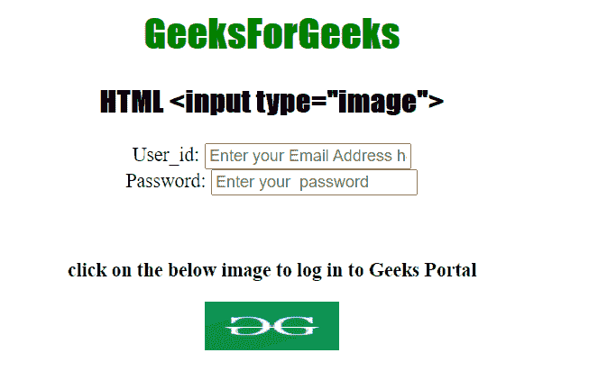

# HTML <input type="”image”">

> 原文:[https://www.geeksforgeeks.org/html-input-typeimage/](https://www.geeksforgeeks.org/html-input-typeimage/)

[HTML <输入>类型属性](https://www.geeksforgeeks.org/html-input-type-attribute/)用于指定要显示的<输入>元素的类型。<输入>类型属性的默认类型为文本。在本文中，我们将图像设置为输入类型值。它创建图像作为提交按钮。

**语法:**

```html
<input type="image">
```

**属性值:**

*   **图像:**用于定义图像为提交按钮。

**特征:**

*   输入元素不接受*值*属性。
*   图像路径在 *src* 属性中定义。
*   输入元素由各种常见属性支持。

**示例 1:** 在本例中，我们将输入类型设置为图像来提交表单。

## 超文本标记语言

```html
<!DOCTYPE html>
<html>

<body style="text-align: center">
    <h1 style="color: green">
        GeeksForGeeks
    </h1>

    <h2>HTML <input type="image"></h2>

    <form>
        Name:
        <input type="text" placeholder
            ="Enter your name here--" /><br />

        Address:
        <input type="text" placeholder
            ="Enter your  permanent Address" /><br />

        Phone No.:
        <input type="tel" placeholder
            ="Enter phone number" />

        <br /><br />
        <input type="image" src=
"https://media.geeksforgeeks.org/wp-content/uploads/gfg-40.png"
            height="80px"
            width="110px" alt="submit" />
    </form>
</body>

</html>
```

**输出:**



**示例 2:** 在本例中，我们将制作一个登录表单&使用图像作为输入类型来提交表单。

## 超文本标记语言

```html
<!DOCTYPE html>
<html>

<head>
    <style>
        h1,
        h2 {
            font-family: impact;
        }
    </style>
</head>

<body style="text-align: center">
    <h1 style="color: green">GeeksForGeeks</h1>

    <h2>HTML <input type="image"></h2>

    <form>
        User_id:
        <input type="email" placeholder=
            "Enter your Email Address h--" /><br />

        Password:
        <input type="password" placeholder=
            "Enter your  password" /><br />
        <br />
        <br />

        <b><p>
            click on the below image to 
            log in to Geeks Portal
        </p></b>

        <input type="image" src=
"https://media.geeksforgeeks.org/wp-content/cdn-uploads/20190710102234/download3.png"
            height="40px" width="110px" alt="submit" />
    </form>
</body>

</html>
```

**输出:**



**支持的浏览器:**

*   谷歌浏览器 4.0 及以上版本
*   微软边缘 12.0 及以上版本
*   Internet Explorer 6.0 及以上版本
*   火狐 2.0 及以上版本
*   Opera 10.0 及以上版本
*   Safari 3.1 及以上版本