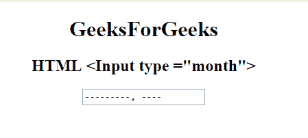

# HTML | <input type="”month”">

> 原文:[https://www.geeksforgeeks.org/html-input-typemonth/](https://www.geeksforgeeks.org/html-input-typemonth/)

**HTML <输入类型=“月”>** 用于指定月、年字段的控制。该值的格式必须为“YYYY-MM”。

**语法:**

```html
<input type="month"> 
```

**示例:**

```html
<!DOCTYPE html> 
<html> 

<head> 
    <title> 
        HTML input type month 
    </title> 
</head> 

<body style="text-align:center;"> 

    <h1>GeeksForGeeks</h1> 

    <h2>HTML <Input type ="month"></h2> 

    <form id="myGeeks"> 
        <input type="month" id="month_id"
                name="geeks" > 
    </form> 
</body> 

</html>                    
```

**输出:**


**支持的浏览器:**输入类型=“月”> 支持的浏览器如下:

*   谷歌 Chrome 25.0
*   Internet Explorer 12.0
*   歌剧 10.1