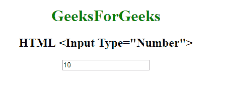

# HTML | <input type="”number”">

> 原文:[https://www.geeksforgeeks.org/html-input-typenumber/](https://www.geeksforgeeks.org/html-input-typenumber/)

**HTML <输入类型=“数字”>** 用于指定输入数字的输入字段。

**语法:**

```html
<input type="number">
```

**示例:**

```html
<!DOCTYPE html> 
<html> 
    <head>
        <title>
            HTML input type number
        </title>
    </head>

    <body style="text-align:center;"> 

        <h1 style="color:green;"> 
            GeeksForGeeks 
        </h1> 

        <h2>HTML <Input Type="Number"></h2> 

        <input type="number" id="myNumber"
                value="10"> 
    </body> 
</html>                    
```

**输出:**


**支持的浏览器:**输入 type="number" > 支持的浏览器如下:

*   谷歌 Chrome
*   微软公司出品的 web 浏览器
*   火狐浏览器
*   旅行队
*   歌剧