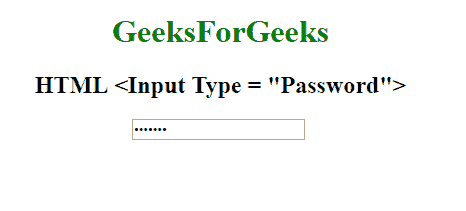

# HTML | <input type="”password”">

> 原文:[https://www.geeksforgeeks.org/html-input-typepassword/](https://www.geeksforgeeks.org/html-input-typepassword/)

**HTML <输入类型=“密码”>** 用于指定输入标签的密码字段。密码应通过 HTTPS 页面提供，因为它包含用户的敏感信息。

**语法:**

```html
<input type="password">
```

**示例:**

```html
<!DOCTYPE html> 
<html> 

<head>
    <title>
        HTML input type password
    </title>
</head>

<body style="text-align:center;"> 

    <h1 style="color:green;"> 
        GeeksForGeeks 
    </h1> 

    <h2>HTML <Input Type = "Password"></h2> 

    <input type="password" id="mypasswd"
            value="geeks12"> 
</body> 

</html>                    
```

**输出:**


**支持的浏览器:**输入 type="password" > 支持的浏览器如下:

*   谷歌 Chrome
*   微软公司出品的 web 浏览器
*   火狐浏览器
*   旅行队
*   歌剧