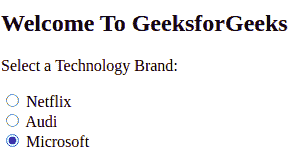
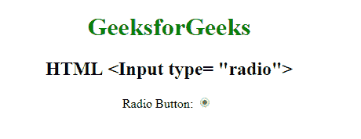

# HTML <input type="”radio”">

> 原文:[https://www.geeksforgeeks.org/html-input-typeradio/](https://www.geeksforgeeks.org/html-input-typeradio/)

**示例:**在本例中，我们只需使用单选按钮从给定选项中选择正确的选项。

## 超文本标记语言

```html
<!DOCTYPE html>
<html>

<body>

  <h2>Welcome To GeeksforGeeks</h2>
  <p>Select a Technology Brand:</p>
  <div>
    <input type="radio" id="Netflix" name="brand" value="Netflix">
    <label for="Netflix">Netflix</label>
  </div>

  <div>
    <input type="radio" id="Audi" name="brand" value="Audi">
    <label for="Audi">Audi</label>
  </div>

  <div>
    <input type="radio" id="Microsoft" name="brand" value="Microsoft" checked>
    <label for="Microsoft">Microsoft</label>
  </div>

</body>

</html>
```

**输出:**



**HTML <输入类型=“单选”>** 用于定义单选按钮。单选按钮用于让用户从预定义选项列表中选择一个选项。单选按钮输入控件是通过使用“input”元素创建的，该元素的类型属性的值为“Radio”。
**语法:**

```html
<input type="radio"> 
```

**例:**

## 超文本标记语言

```html
<!DOCTYPE html>
<html>

<head>
  <title>
    HTML input type radio
  </title>

  <style>
    body {
      text-align: center;
    }

    h1 {
      color: green;
    }
  </style>
</head>

<body>
  <h1>
    GeeksforGeeks
  </h1>

  <h2>
    HTML <Input type= "radio">
  </h2>

  Radio Button:
  <input type="radio" checked=true id="radioID" value="Geeks_radio" 
         name="Geek_radio">
</body>

</html>
```

**输出:**



**支持的浏览器:**

*   谷歌 Chrome
*   微软公司出品的 web 浏览器
*   火狐浏览器
*   旅行队
*   歌剧
*   边缘 12 及以上