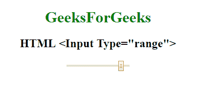

# HTML | <input type="”range”">

> 原文:[https://www.geeksforgeeks.org/html-input-typerange/](https://www.geeksforgeeks.org/html-input-typerange/)

**HTML <输入类型=“范围”>** 用于*定义对用户输入的数字*的控制。它可以对用户将要输入的不重要的数字或值设置限制。它的默认范围值从 0 到 100。

**语法:**

```html
<input type="range"> 
```

**示例:**

```html
<!DOCTYPE html>
<html>

<head>
    <title>
        HTML Input Type range
    </title>
</head>
<style>
    #Geek_p {
        font-size: 30px;
        color: green;
    }
</style>

<body style="text-align:center;">

    <h1 style="color:green;"> 
            GeeksForGeeks 
        </h1>

    <h2>HTML <Input Type="range"> 
</h2>
    <input type="range" 
           id="Geek_Range" 
           value="90">
</body>

</html>
```

**输出:**


**支持的浏览器:**

*   谷歌 Chrome 4.0
*   Firefox 23.0
*   Edge 10.0
*   歌剧 10.1
*   苹果 Safari 3.1