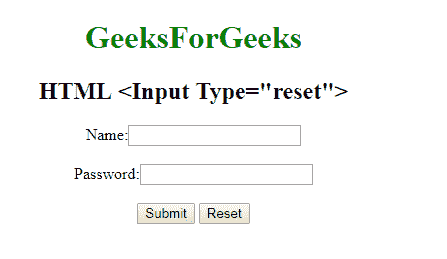

# HTML | <input type="”reset”">

> 哎哎哎:# t0]https://www . geeksforgeeks . org/html-input-type reset/

**HTML <输入类型=“复位”>** 用于*定义一个复位按钮*。重置按钮用于将所有表单值重置为其初始值。

**语法:**

```html
<input type="reset">> 
```

**示例:**

```html
<!DOCTYPE html>
<html>

<head>
    <title>
        HTML Input Type reset
    </title>
</head>
<style>
    #Geek_p {
        font-size: 30px;
        color: green;
    }
</style>

<body style="text-align:center;">

    <h1 style="color:green;"> 
            GeeksForGeeks 
        </h1>

    <h2>HTML Input Type reset 
</h2>
    <form>
        Name:
        <input type="text">
        <br>
        <br> Password:
        <input type="password">
        <br>
        <br>

        <input type="submit">
        <input type="reset">
    </form>
</body>

</html>
```

**输出:**


**支持的浏览器:**

*   谷歌 Chrome
*   火狐浏览器
*   边缘
*   歌剧
*   苹果 Safari