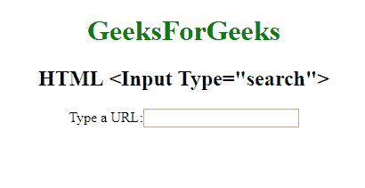

# HTML | <input type="”search”">

> 原文:[https://www.geeksforgeeks.org/html-input-typesearch/](https://www.geeksforgeeks.org/html-input-typesearch/)

**HTML <输入类型=“搜索”>** 用于*定义输入搜索字符串*的文本字段。

**语法:**

```html
<input type="search">
```

**示例:**

```html
<!DOCTYPE html>
<html>

<head>
    <title>
        HTML Input Type Search
    </title>
</head>
<style>
    #Geek_p {
        font-size: 30px;
        color: green;
    }
</style>

<body style="text-align:center;">

    <h1 style="color:green;"> 
            GeeksForGeeks 
        </h1>

    <h2>HTML <Input Type="search"> 
</h2>
    <form>
        Type a URL:
        <input type="search">
        <br>
        <br>
    </form>
</body>

</html>
```

**输出:**


**支持的浏览器:**

*   谷歌 Chrome 26.0
*   Firefox 4.0
*   Edge 10.0
*   歌剧 12.1
*   苹果 Safari 4.1