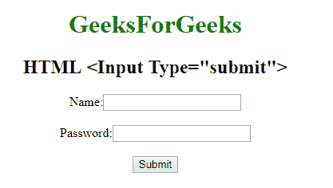

# HTML | <input type="”submit”">

> 原文:[https://www.geeksforgeeks.org/html-input-typesubmit/](https://www.geeksforgeeks.org/html-input-typesubmit/)

**HTML <输入类型=“提交”>** 用于*定义提交按钮*。它用于将所有用户值提交给表单处理程序。表单处理程序是一个服务器页面，它激活一个脚本来处理所有的输入值。

**语法:**

```html
<input type="submit"> 
```

**示例:**

```html
<!DOCTYPE html>
<html>

<head>
    <title>
        HTML Input Type submit
    </title>
</head>
<style>
    #Geek_p {
        font-size: 30px;
        color: green;
    }
</style>

<body style="text-align:center;">

    <h1 style="color:green;"> 
            GeeksForGeeks 
        </h1>

    <h2>HTML <Input Type="submit"> 
</h2>
    <form>
        Name:
        <input type="text">
        <br>
        <br> Password:
        <input type="password">
        <br>
        <br>

        <input type="submit">
    </form>
</body>

</html>
```

**输出:**


**支持的浏览器:**

*   谷歌 Chrome
*   火狐浏览器
*   边缘
*   歌剧
*   苹果 Safari