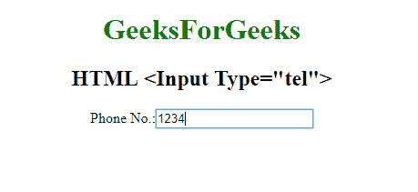

# HTML | <input type="”tel”">

> 原文:[https://www.geeksforgeeks.org/html-input-typetel/](https://www.geeksforgeeks.org/html-input-typetel/)

**HTML <输入类型=“电话”>** 用于*定义输入用户电话号码*的字段。

**语法:**

```html
<input type="tel"> 
```

**示例:**

```html
<!DOCTYPE html>
<html>

<head>
    <title>
        HTML Input Type Tel
    </title>
</head>
<style>
    #Geek_p {
        font-size: 30px;
        color: green;
    }
</style>

<body style="text-align:center;">

    <h1 style="color:green;"> 
            GeeksForGeeks 
        </h1>

    <h2>HTML <Input Type="tel"> 
</h2>
    <form>
        Phone No.:
        <input type="tel">
        <br>
        <br>

    </form>
</body>

</html>
```

**输出:**


**支持的浏览器:**

*   谷歌 Chrome
*   火狐浏览器
*   边缘
*   歌剧
*   苹果 Safari