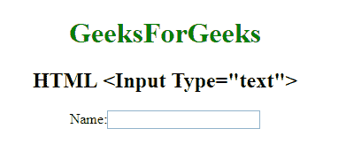

# HTML | <input type="”text”">

> 原文:[https://www.geeksforgeeks.org/html-input-typetext/](https://www.geeksforgeeks.org/html-input-typetext/)

**HTML <输入类型=“文本”>** 用于定义单行文本字段。文本字段的默认宽度为 20 个字符。

**语法:**

```html
<input type="text">
```

**示例:**

```html
<!DOCTYPE html> 
<html> 

<head> 
    <title> 
        HTML input type text 
    </title> 
</head> 

<body style="text-align:center;"> 

    <h1 style="color:green;"> 
        GeeksForGeeks 
    </h1> 

    <h2>
        HTML <Input Type="text"> 
    </h2> 

    <form>
        Name: <input type="text">
    </form>
</body> 

</html>                    
```

**输出:**


**支持的浏览器:**输入 type="text" > 支持的浏览器如下:

*   谷歌 Chrome
*   微软公司出品的 web 浏览器
*   火狐浏览器
*   旅行队
*   歌剧