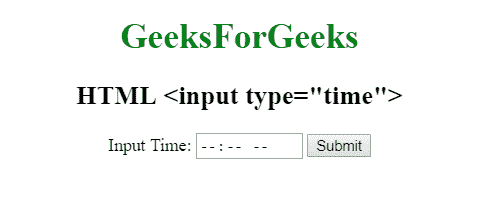

# HTML | <input type="”time”">

> 原文:[https://www.geeksforgeeks.org/html-input-typetime/](https://www.geeksforgeeks.org/html-input-typetime/)

**HTML <输入类型=“时间”>** 用于指定输入时间控制字段。

**语法:**

```html
<input type="time">
```

**示例:**

```html
<!DOCTYPE html> 
<html> 

<head> 
    <title> 
        HTML input type time 
    </title> 
</head> 

<body style="text-align:center;"> 

    <h1 style="color:green;"> 
        GeeksForGeeks 
    </h1> 

    <h2>HTML <input type="time"></h2> 

    <form action="#">
        Input Time: <input type="time" name="time">

        <input type="submit" value="Submit">
    </form>
</body> 

</html>                                    
```

**输出:**


**支持的浏览器:**输入 type="time" > 支持的浏览器如下:

*   谷歌 Chrome 20.0
*   Internet Explorer 12.0
*   Firefox 57.0
*   歌剧 10.1