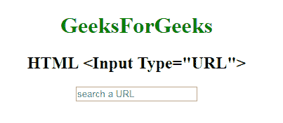

# HTML | <input type="”url”">

> 哎哎哎:# t0]https://www . geeksforgeeks . org/html-input-type URL/

**HTML <输入类型=“网址”>** 用于*定义一个输入网址*的字段。在提交表单之前，会自动验证该输入值。

**语法:**

```html
<input type="url"> 
```

**示例:**

```html
<!DOCTYPE html>
<html>

<head>
    <title>
        HTML Input Type URL
    </title>
</head>
<style>
    #Geek_p {
        font-size: 30px;
        color: green;
    }
</style>

<body style="text-align:center;">

    <h1 style="color:green;"> 
            GeeksForGeeks 
        </h1>

    <h2>HTML <Input Type="URL"> 
</h2>
    <form>
        <input type="url"
               placeholder="search a URL">
        <br>
        <br>

    </form>
</body>

</html>
```

**输出:**


**支持的浏览器:**

*   谷歌 Chrome
*   火狐浏览器
*   Edge 10.0
*   歌剧 10.1
*   苹果 Safari