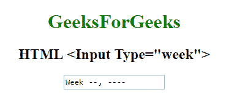

# HTML | <input type="”week”">

> 原文:[https://www.geeksforgeeks.org/html-input-typeweek/](https://www.geeksforgeeks.org/html-input-typeweek/)

**HTML <输入类型=“周”>** 用于定义*一周一年控制字段*。

**语法:**

```html
<input type="week">
```

**示例:**

```html
<!DOCTYPE html>
<html>

<head>
    <title>
        HTML Input Type week
    </title>
</head>
<style>
    #Geek_p {
        font-size: 30px;
        color: green;
    }
</style>

<body style="text-align:center;">

    <h1 style="color:green;"> 
            GeeksForGeeks 
        </h1>

    <h2>HTML <Input Type="week"> 
</h2>
    <form>
        <input type="week">
        <br>
        <br>

    </form>
</body>

</html>
```

**输出:**


**支持的浏览器:**以下是 **HTML Input type="week"** 支持的浏览器:

*   谷歌 Chrome
*   Internet Explorer 10.0 +
*   火狐浏览器
*   歌剧
*   旅行队