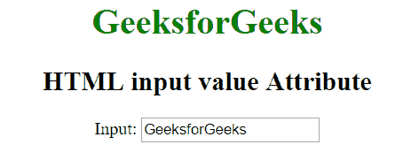
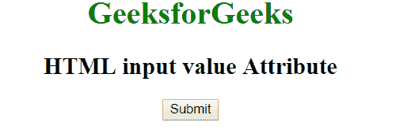

# HTML |输入值属性

> 原文:[https://www.geeksforgeeks.org/html-input-value-attribute/](https://www.geeksforgeeks.org/html-input-value-attribute/)

HTML 中<输入>元素的**值**属性用于指定输入元素的初始值。它对于不同的输入类型有不同的含义:

*   “按钮”、“重置”和“提交”属性指定按钮上的文本。
*   “文本”、“密码”和“隐藏”属性指定输入字段的初始值。
*   “复选框”、“单选”和“图像”属性指定与输入相关联的值。

**语法:**

```html
<input value = "text">
```

**属性值:**包含单值**文本**，指定输入元素的值。

**例 1:** 本例描述<输入>值属性。

```html
<!DOCTYPE html>
<html>

<head>
    <title>HTML input value Attribute</title>
</head>

<body style = "text-align:center">

    <h1 style = "color:green;">
        GeeksforGeeks
    </h1>

    <h2>
        HTML input value Attribute
    </h2>

    Input: <input type = "text" 
            value = "GeeksforGeeks">
</body>

</html>                    
```

**输出:**


**例 2:** 本例描述<输入>值属性。

```html
<!DOCTYPE html>
<html>

<head>
    <title>HTML input value Attribute</title>
</head>

<body style = "text-align:center">

    <h1 style = "color:green;">
        GeeksforGeeks
    </h1>

    <h2>
        HTML input value Attribute
    </h2>

    <input type = "button" value = "Submit">
</body>

</html>
```

**输出:**


**支持的浏览器:**输入>值属性支持的浏览器如下:

*   苹果 Safari 1.0
*   谷歌 Chrome 1.0
*   Firefox 1.0
*   Opera 1.0
*   Internet Explorer 2.0