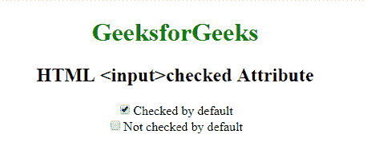

# HTML | <input>勾选属性

> 原文:[https://www.geeksforgeeks.org/html-inputchecked-attribute/](https://www.geeksforgeeks.org/html-inputchecked-attribute/)

**HTML <输入>勾选属性**用于*指示页面加载*时是否需要勾选<输入>元素。它是一个布尔属性。
它只能用于类型为**“复选框”**或**“单选”**的元素。

**语法:**

```html
<input type = "checkbox|radio" checked> 
```

**示例:**本示例说明了在输入元素中使用选中的属性。

```html
<!DOCTYPE html>
<html>

<head>
    <title>
      HTML <input>checked 
      Attribute
  </title>
</head>

<body style="text-align: center;">
    <h1 style="color: green;">
      GeeksforGeeks
  </h1>
    <h2>
      HTML <input>checked 
      Attribute
  </h2>
    <form>
        <!-- Below input elements 
           have attribute "checked" -->
        <input type="checkbox" 
               name="check" 
               value="1"
               checked>
      Checked by default
        <br>
        <input type="checkbox"
               name="check" 
               value="2">
      Not checked by default
        <br>
    </form>
</body>

</html>
```

**输出:**


**支持的浏览器:**支持的浏览器 **HTML <输入>勾选属性**如下:

*   谷歌 Chrome
*   微软公司出品的 web 浏览器
*   火狐浏览器
*   歌剧
*   旅行队