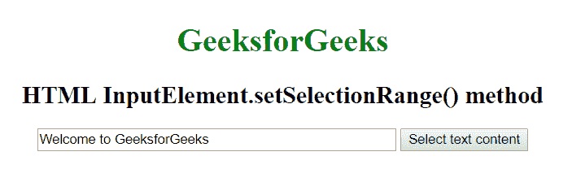
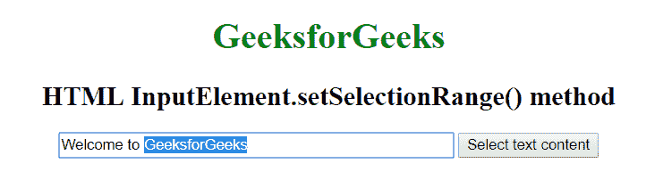

# HTML | inputtelement . setselectionrange()方法

> 原文:[https://www . geesforgeks . org/html-inputrement-setselectionrange-method/](https://www.geeksforgeeks.org/html-inputelement-setselectionrange-method/)

方法用于设置当前索引值的开始和结束位置，以选择输入或文本区域元素中的文本。

**语法:**

```html
element.setSelectionRange( Start, End, Direction );
```

**参数:**该功能接受三个参数，如上所述，描述如下:

*   **开始:**该参数保存第一个选中字符的索引。索引值大于指向结束值的元素的长度。
*   **结束:**此参数保存最后一个选定字符后的字符索引。索引值大于指向结束值的元素的长度。
*   **方向:**该参数保存进行选择操作的方向。方向的可能值为:*前进，后退*和*无*。

**示例:**

```html
<!DOCTYPE html> 
<html> 

<head> 
    <title>
        HTML | InputElement.setSelectionRange() method
    </title> 
</head> 

<body style="text-align:center;"> 

    <h1 style="color:green;"> 
        GeeksforGeeks 
    </h1> 

    <h2>
        HTML InputElement.setSelectionRange() method
    </h2> 

    <input type="text" id="geeks" size="50"
        value="Welcome to GeeksforGeeks">

    <button onclick="myGeeks()">
        Select text content
    </button> 

    <script> 
        function myGeeks() {
            const input = document.getElementById('geeks'); 
            input.focus();
            input.setSelectionRange(11, 24);
        }
    </script> 
</body>

</html>
```

**输出:**
**点击按钮前:**

**点击按钮后:**


**支持的浏览器:**HTML inputrement . setselectionrange()方法支持的浏览器如下:

*   谷歌 Chrome 1.0
*   Internet Explorer 9.0
*   Firefox 1.0
*   旅行队
*   Opera 8.0