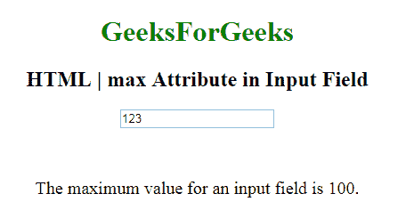

# HTML | <input>最大属性

> 原文:[https://www.geeksforgeeks.org/html-inputmax-attribute/](https://www.geeksforgeeks.org/html-inputmax-attribute/)

**HTML| <输入>最大属性**用于*指定输入字段*的最大值。它可以与 min 属性一起使用来创建一个值范围。它可以与许多输入字段一起使用，如数字、范围、日期、日期时间、本地日期时间、月份、时间和星期。

**语法:**

```html
<input max="number|date"> 
```

**属性值:**

*   **数字:**它包含值，即指定输入字段允许的最大值的数字。
*   **日期:**包含值，即指定<输入>日期字段允许的最大日期的日期。

**示例:**

```html
<!DOCTYPE html>
<html>

<body style="text-align:center;">

    <h1 style="color:green;"> 
            GeeksForGeeks 
        </h1>

    <h2> 
    HTML | max Attribute in Input Field 
</h2>
    <form id="myGeeks">
        <input type="number" 
               id="myNumber"
               step="5" 
               name="geeks" 
               placeholder="multiples of 5" 
               max="100">
    </form>
    <br>
    <br>
    <p style="font-size:20px;">
        The maximum value for an input
        field is 100.
    </p>
</body>

</html>
```

**输出:**


**支持的浏览器:**输入>最大属性的 **HTML | <支持的浏览器如下:**

*   谷歌 Chrome
*   微软公司出品的 web 浏览器
*   火狐浏览器
*   歌剧
*   旅行队