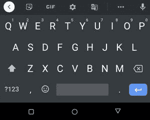
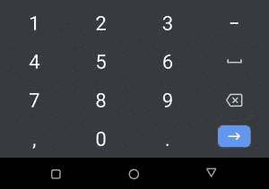
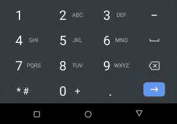
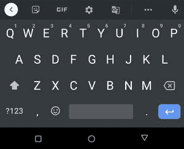
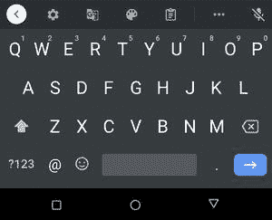
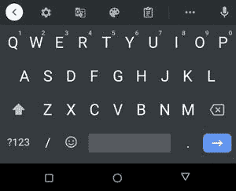
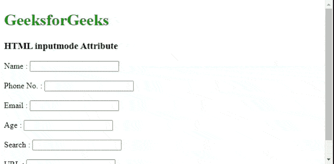

# HTML 输入码属性

> 原文:[https://www.geeksforgeeks.org/html-inputmode-attribute/](https://www.geeksforgeeks.org/html-inputmode-attribute/)

***inputmode*** 是一个 HTML [**全局属性**](https://www.geeksforgeeks.org/html-global-attributes/) (全局属性是所有 HTML 元素共有的)，当用户为某个 [**输入**](https://www.geeksforgeeks.org/html-input-tag/) 或 [**textarea**](https://www.geeksforgeeks.org/html-textarea-tag/) 元素选择了一个区域时，它可以帮助带有屏幕键盘的浏览器或设备决定显示哪个键盘。

*   *输入模式*属性不会改变浏览器解释输入的方式。它根据各种输入指示浏览器显示哪个键盘。
*   *输入模式*是一个非常古老的概念，但只有部分浏览器采用了它。一些主要的浏览器是 iOS 的 Safari 和安卓的 chrome。之前它是在 2012 年由火狐实现的，但是几个月后就被弃用了。
*   *输入模式*接受多个值。让我们一个接一个地看一看。

**语法:**

```html
<input type ="number" id="age" inputmode="numeric" />
```

***输入模式*** 属性可以有以下值。

*   **无:**

```html
<input type="text" inputmode="none" />
```

值 ***【无】*** 表示屏幕键盘显示“否”。这用于浏览器或任何应用程序自己处理 VK(虚拟键盘)的情况(自编码)。

*   **文字:**

```html
<input type="text" inputmode="text" />
```

值**显示特定地区的标准键盘。**

**

输入模式=文本在安卓 11 上** 

*   ****数字:****

```html
<input type="text" inputmode="numeric" />
```

**数值**保证屏幕键盘上显示 0 到 9 的数字。减号键可以显示，也可以不显示。****

****

输入模式=数字在安卓 11 上**** 

*   ******十进制：******

```html
**<input type="text" inputmode="decimal" />**
```

****数值 ***【小数】*** 确保除了 0 到 9 的数字外，还有特定于地区的小数分隔符(")或“，”)必须显示。减号键可以显示，也可以不显示。****

****

输入模式=十进制在安卓 11 上**** 

*   ******电话:******

```html
**<input type="text" inputmode="tel" />**
```

****数值**在屏幕键盘上显示数字以及井号(*)和星号(*)键。这是用来输入电话号码的。******

******

input mode = Android 11 上的 tel****** 

*   ********搜索:********

```html
**<input type="text" inputmode="search" />**
```

****值 ***搜索*** 向保证屏幕键盘应该具有这样的布局，以便于搜索，这样的布局具有标记为“**搜索**的“**回车**键”，或者可能是任何搜索图标或类似的。****

****

输入模式=在安卓 11 上搜索**** 

*   ******邮件:******

```html
**<input type="text" inputmode="email" />**
```

****值**保证屏幕键盘必须显示“ **@** ”字符，便于用户输入邮件。******

****

输入模式=安卓 11 上的电子邮件**** 

*   ******url:******

```html
**<input type="text" inputmode="url" />**
```

****值 ***url*** 保证屏幕键盘必须显示“ **/** ”字符，便于用户输入 url。****

****

在安卓 11 上**** 

******示例:******

## ****超文本标记语言****

```html
**<!DOCTYPE html>
<html lang="en">

<head>
    <title>HTML inputmode Attribute</title>
</head>

<body>
    <h1 style="color:green;">
        GeeksforGeeks
    </h1>

    <h3>HTML inputmode Attribute</h3>

    Name : <input type="text" id="text" 
        inputmode="text" /><br><br>

    Phone No. : <input type="tel" 
        id="phone" inputmode="tel" /><br><br>

    Email : <input type="email" 
        id="email" inputmode="email" /><br><br>

    Age : <input type="number" id="age" 
        inputmode="numeric" /><br><br>

    Search : <input type="search" id="search" 
        inputmode="search" /><br><br>

    URL : <input type="url" id="url" 
        inputmode="url" /><br><br>
</body>

</html>**
```

******输出:******

********

******优势:******

****使用 ***输入模式*** 属性是处理文本框时必须的，因为它增加了用户输入的便利性。****

******支持的浏览器:******

*   ****支持 chrome–66 及以上版本。****
*   ****支持 iOS–12.2 及以上版本上的 Safari。****