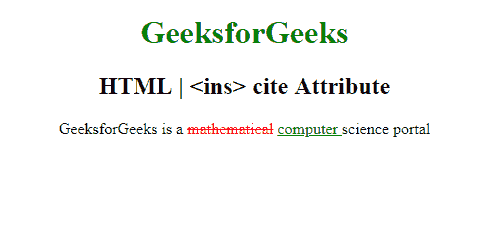

# HTML | ins 引用属性

> 原文:[https://www.geeksforgeeks.org/html-ins-cite-attribute/](https://www.geeksforgeeks.org/html-ins-cite-attribute/)

**HTML < ins >引用属性**用于指定*文档或消息的网址，表示删除文本*的原因。
**语法:**

```html
<ins cite="URL">
```

**属性值:**

*   **网址:**它指定了文档的网址，该网址定义了文本删除其他先前文本的原因。

**可能的值有:**

*   **绝对 URL:** 用于指出其他网站(如 cite ="http://www.w3schools.com ")
*   **相对 URL:** 用于指出网站内的页面。(如 cite="geeks.htm ")。

**例:**

## 超文本标记语言

```html
<!DOCTYPE html>
<html>

<head>
    <title>
      HTML |
      <ins> cite Attribute
  </title>
    <style>
        del {
            color: red;
        }

        ins {
            color: green;
        }

        h1 {
            color: green;
        }

        body {
            text-align: center;
        }
    </style>
</head>

<body>
    <h1>GeeksforGeeks</h1>
    <h2>HTML | <ins> cite Attribute</h2>

<p>GeeksforGeeks is a
        <del>mathematical</del>

        <!-- Assigning id to 'ins' tag -->
        <ins id="GFG" cite="ide.GeeeksForGeeks.com">
            computer
        </ins>science portal</p>

</body>

</html>
```

**输出:**



**支持的浏览器:**T2 HTML<ins>引用属性支持的浏览器如下:

*   谷歌 Chrome
*   微软公司出品的 web 浏览器
*   火狐浏览器
*   歌剧
*   旅行队