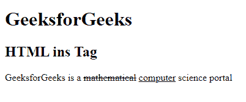
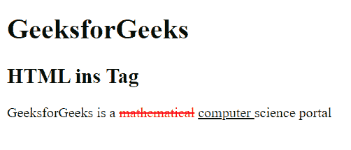

# HTML ins 标签

> 原文:[https://www.geeksforgeeks.org/html-ins-tag/](https://www.geeksforgeeks.org/html-ins-tag/)

HTML 中的<ins>标记用于指定插入的文本块。<ins>标签通常用于标记已添加到文档中的文本范围。网页浏览器会将插入的文字呈现为加底线的文字，不过这个属性可以使用 CSS 文字装饰属性来变更。<ins>标签需要一个开始和结束标签。</ins></ins></ins> 

**语法:**

```html
<ins> Contents... </ins>
```

**属性:**

*   [**cite:**](https://www.geeksforgeeks.org/html-ins-cite-attribute/) 用于指定表示插入文本原因的文档或消息的 URL。
*   [**日期时间:**](https://www.geeksforgeeks.org/html-ins-datetime-attribute/) 用于指定插入文本的日期和时间。日期时间以 *YYYY-MM-DDThh:mm:ssTZD* 的格式插入。

**示例 1:** 该示例描述了< ins >标签的使用。

## 超文本标记语言

```html
<!DOCTYPE html>
<html>

<body>
    <h1>GeeksforGeeks</h1>

    <h2>HTML ins Tag</h2>

    <p>
        GeeksforGeeks is a <del>mathematical</del>
        <ins>computer</ins> science portal
    </p>
</body>

</html>
```

**输出:**



**示例 2:** 本示例使用带有 datetime 属性的< ins >标记，并且还使用了一些 CSS 样式。

## 超文本标记语言

```html
<!DOCTYPE html>
<html>

<head>
    <style>
        del {
            color: red;
        }

        ins {
            color: green;
        }
    </style>
</head>

<body>
    <h1>GeeksforGeeks</h1>

    <h2>HTML ins Tag</h2>

    <p>
        GeeksforGeeks is a <del>mathematical</del>
        <ins datetime="2018-11-21T15:55:03Z">
            computer
        </ins> science portal
    </p>
</body>

</html>
```

**输出:**



**支持的浏览器:**

*   谷歌 Chrome
*   微软公司出品的 web 浏览器
*   火狐浏览器
*   歌剧
*   旅行队