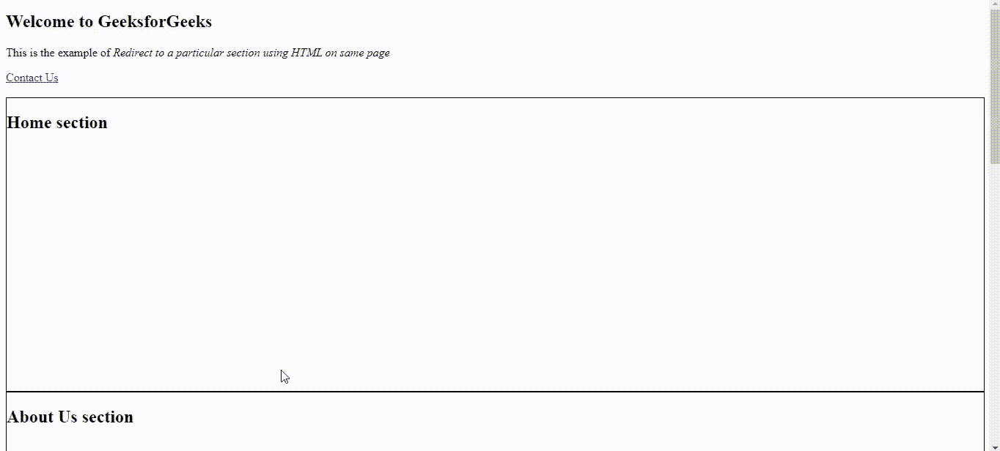

# HTML 面试问题集–1

> 原文:[https://www . geesforgeks . org/html-面试-问题-集合-1/](https://www.geeksforgeeks.org/html-interview-questions-set-1/)

[**1。什么是 HTML？**T3】](https://www.geeksforgeeks.org/html-introduction/)

**HTML** 代表超文本标记语言。它用于使用标记语言设计网页。HTML 是超文本和标记语言的结合。超文本定义了网页之间的链接。标记语言用于定义标签内的文本文档，标签定义网页的结构。HTML 用于构建网站，因此用于网络开发。

[**2。HTML 和 XHTML 的区别。**](https://www.geeksforgeeks.org/difference-between-xhtml-and-html5/)

<figure class="table">T42】扩展而来 T50】发布年份 T52】开发于 1991 年 T54】发布于 2000 年T57】

| keyword | 超文本标记语言 | 可扩展的超文本标记语言 |
| --- | --- | --- |
| Full form | Hypertext markup language. | extensible hypertext markup language |
| filename extension | 。html .html 文件的后缀 | . xhtml、. xht . xml |
| by | Tim Berners - Lee | W3C is the World Wide Web Consortium. |
| 标准通用标识语言 | 可扩展标记语言和超文本标记语言 |

</figure>

[**3。有哪些不同的标记语言，它们之间有什么区别？**T3】](#")

*   超文本标记语言
*   KML——关键整体标记语言
*   数学标记语言
*   标准通用标记语言
*   可扩展超文本标记语言
*   可扩展标记语言

[**4。HTML 和 HTML 5 有什么区别？**](https://www.geeksforgeeks.org/difference-between-html-and-html5/)

<figure class="table">

| 

**HTML**

 | 

**HTML 5**

 |
| --- | --- |
| It does not support audio and video without the support of flash player. | Support audio and video control, using and tags. |
| It uses cookies to store temporary data. | It uses SQL database and application cache to store offline data. |
| JavaScript is not allowed to run in the browser. | Allow JavaScript to run in the background. This may be due to JS Web worker API in HTML5. |
| With the help of VML, Silver Light, Flash and other technologies, vector graphics become possible in HTML. | Vector graphics are an indispensable part of HTML5, just like SVG and canvas. |
| It does not allow drag effect. | Allow drag effect. |
| Can't draw circles, rectangles, triangles and other shapes. | HTML5 allows drawing circles, rectangles, triangles and other shapes. |
| It is suitable for all old browsers. | All new browsers support it, such as Firefox, Mozilla, Chrome, Safari and so on. |
| The old version of HTML is not suitable for mobile. | HTML5 language is more mobile friendly. |
| Doctype declaration is too long and complicated. | Doctype's declaration is quite simple and easy. |
| The navigation, title and other elements do not exist. | New elements of the web page structure, such as navigation, header, footer, etc. |
| Character encoding is lengthy and complicated. | Character coding is simple and easy. |
| It's almost impossible to get the user's real geographical location with the help of browser. | Using JS geolocation API, you can easily track the geographical location of users. |
| It can't handle inaccurate grammar. | It can handle inaccurate grammar. |
| Attributes such as character set, asynchrony and ping are missing in HTML. | Character set, asynchronous and ping properties are part of HTML 5. |

</figure>

[**5。HTML 的当前版本是什么？**T3】](#)

HTML 5 是 HTML 的第五个也是目前的版本。

[**6。什么是！DOCTYPE？**T3】](https://www.geeksforgeeks.org/html-doctypes/)

文档类型或文档类型声明是一个指令，它告诉 web 浏览器当前页面所用的标记语言。文档类型不是一个元素或标签，它让浏览器知道文档中使用的 HTML 或任何其他标记语言的版本或标准。【HTML5 的 DOCTYPE 不区分大小写，可以写成如下所示:

```html
<!DOCTYPE html>
```

[**7。什么是元素和标签，以及两者之间的区别？**T3】](#)

*   **HTML 标签:**标签是 HTML 元素的开始和结束部分。它们以<符号开始，以>符号结束。<和>里面写的东西都叫标签。

    **示例:**

    ```html
    <b> </b>  
    ```

*   **HTML 元素:**元素将内容包含在标签之间。它们由某种结构或表达组成。它通常由开始标签、内容和结束标签组成。

    **示例:**

    ```html
    <b>This is the content.</b>
    ```

<figure class="table">

| HTML 标签 | 超文本标记语言元素 |
| --- | --- |
| 打开或关闭，用于标记元素的开始或结束 | 开始标记、结束标记及其属性的集合 |
| 用于保存 HTML 元素 | 保存内容 |
| 从< and ends with >开始 | 无论在一个 HTML 标签中写了什么，都是 HTML 元素 |

</figure>

[**8。陈述各种标题标签，它们有什么重要性吗？**T3】](https://www.geeksforgeeks.org/html-heading)

HTML 定义了六个级别的标题。这六个标题元素是 H1、H2、H3、H4、H5 和 H6；H1 是最高级别，H6 是最低级别。

**航向的重要性:**

1.  搜索引擎使用标题来索引网页的结构和内容。
2.  标题用于突出重要的主题。
3.  它们提供了有价值的信息，并告诉我们文档的结构。

[**9。** **如何使用 HTML 重定向到页面的特定部分？**](#)

可以使用锚点标签重定向到同一页面上的特定部分。您需要将“id 属性”添加到要显示的部分，并在 href 属性中使用相同的 id，在锚点标记中使用“#”。这样，当点击一个特定的链接时，您将被重定向到与锚点标签中提到的 id 相同的部分。

**语法:**

```html
// Anchor tag
<a href="#home_section">home</a>

<section id="home_section">Information About Page</section>
```

**示例:**当用户点击“联系我们”链接时，将被重定向到同一页面的“联系我们”部分。

## 超文本标记语言

```html
<!DOCTYPE html>
<html>

<head>
    <style>
        div {
            width: 100%;
            height: 400px;
            border: 1px solid black;
        }
    </style>
</head>

<body>
    <h2>Welcome to GeeksforGeeks</h2>
    <p>This is the example of
        <i>Redirect to a particular section 
            using HTML on same page</i>
    </p>

    <a href="#contactUs"> Contact Us </a>
    <br/></br>
    <div>
        <h2>Home section</h2>
        </h>
    </div>
    <div>
        <h2>About Us section</h2>
    </div>

    <div id="contactUs">
        <h2>Contact Us section </h2>
    </div>
    <div>
        <h2>Team Section</h2>
    </div>
</body>

</html>
```

**输出:**

[](https://www.geeksforgeeks.org/html-attributes)

[**10。什么是属性？**T3】](https://www.geeksforgeeks.org/html-attributes)

属性用于提供关于元素的额外信息。

*   所有的 HTML 元素都可以有属性。属性提供关于元素的附加信息。
*   它需要两个参数:**名称和值。**这些定义了元素的属性，并放置在元素的开始标签中。name 参数采用我们希望分配给元素的属性的名称，该值采用属性的值或属性名称的范围，这些属性名称可以在元素上对齐。
*   每个名字都有一些必须用引号括起来的价值。

**语法:**

```html
<element attribute_name="attribute_value">
```

[**11。< b >和<强>标签一样吗？如果不是，那为什么？**T3】](https://www.geeksforgeeks.org/difference-between-strong-and-bold-tag-in-html/)

*   [**HTML 强标签:**](https://www.geeksforgeeks.org/html-strong-tag/)**强**标签是用于格式化 HTML 文本的 HTML 元素之一。它用于通过加粗或在语义上突出显示文本的重要性。

    **语法:**

    ```html
    <strong> Contents... </strong>
    ```

*   [**HTML 加粗标签:**](https://www.geeksforgeeks.org/html-b-tag/)**加粗**标签或< b >也是 HTML 的格式元素之一。写在< b >标签下的文本使文本看起来醒目，以引起注意。

    **语法:**

    ```html
    <b> Contents... </b>
    ```

这两个标签的主要区别在于*强*标签在语义上强调的是重要的词或词段，而*粗体*标签只是在*粗体*中常规样式的偏移文本。

[**12。< em >和< i >标签有什么区别？**T3】](https://www.geeksforgeeks.org/difference-between-i-and-em-tag-of-html/)

*   [**< i >标签:**](https://www.geeksforgeeks.org/html-i-tag/) 它是 HTML 的元素之一，用于格式化 HTML 文本。它用于以专业术语、替代语气或声音、思想等来定义文本。

    **语法:**

    ```html
    <i> Content... </i>
    ```

*   [**< em >标签:**](https://www.geeksforgeeks.org/html-em-tag/) 它也是 HTML 中用于格式化文本的元素之一。它用于定义强调的文本或语句。

    **语法:**

    ```html
    <em> Content... </em>
    ```

    默认情况下，视觉结果是相同的，但这两个标签之间的主要区别是,*标签在语义上强调了重要的单词或单词的一部分，而*标签只是传统上以斜体样式显示的偏移文本，以显示替代的语气或声音。**

    [**13。HTML 中的注释是如何添加的？**T3】](https://www.geeksforgeeks.org/html-comments/)

    注释标签()用于在 HTML 代码中插入注释。

    **HTML 注释的类型:**HTML 中有三种类型的注释，分别是:

    *   单行注释

        ```html
         <!--This is single line comment -->
        ```

    *   多行评论

        ```html
        <!-- This is
        multi-line
        comment -->
        ```

    *   使用<comment>标签

        ```html
        <comment>This is multi-line
            comment
        </comment>
        ```</comment> 

    **14。HTML 中颜色可以声明的不同格式有哪些？**

    元素的颜色可以通过以下方式定义:

    *   内置颜色
    *   RGB 格式
    *   RGBA 格式
    *   十六进制表示法
    *   high-speedlaunch 高速快艇
    *   high-strength low-alloy 高力低合金

    **内置颜色:**这些是一组预定义的颜色，按其名称使用。例如:红色、蓝色、绿色等。
    **语法:**

    ```html
    h1 {
        color: color-name;
    }
    ```

    **RGB 格式:**RGB(红、绿、蓝)格式用于通过指定 0 到 255 之间的 R、G、B 值来定义 HTML 元素的颜色。例如:红色的 RGB 值为(255，0，0)，绿色为(0，255，0)，蓝色为(0，0，255)等。
    **语法:**

    ```html
    h1 {
        color: rgb(R, G, B);
    }
    ```

    **RGBA 格式:**RGBA 格式类似于 RGB，但不同的是 RGBA 包含指定元素透明度的 A (Alpha)。α的值介于 0.0 到 1.0 之间，其中 0.0。表示完全透明，1.0 表示不透明。
    **语法:**

    ```html
    h1 {
        color:rgba(R, G, B, A);
    }
    ```

    **十六进制记数法:**十六进制记数法以#符号开头，后跟 6 个字符，每个字符的范围从 0 到 f。例如:红色#FF0000，绿色#00FF00，蓝色#0000FF 等。
    **语法:**

    ```html
    h1 {
        color:#(0-F)(0-F)(0-F)(0-F)(0-F)(0-F);
    }
    ```

    **HSL:** HSL 分别代表色相、饱和度和明度。这种格式使用圆柱坐标系。

    *   **色相:**色相是色轮的度数。它的值介于 0 到 360 之间，其中 0 代表红色，120 代表绿色，240 代表蓝色。
    *   **饱和度:**取百分比值，100%代表完全饱和，0%代表完全不饱和(灰色)。
    *   **明度:**取百分比值，100%代表白色，0%代表黑色。

    **语法:**

    ```html
    h1 {
        color:hsl(H, S, L);
    }
    ```

    **HSLA:**HSLA 颜色属性与 HSL 属性相似，不同的是 HSLA 包含指定元素透明度的 A (Alpha)。α的值介于 0.0 到 1.0 之间，其中 0.0。表示完全透明，1.0 表示不透明。
    **语法:**

    ```html
    h1 {
        color:hsla(H, S, L, A);
    }
    ```

    [**15。如何在 HTML 中创建链接？**T3】](https://www.geeksforgeeks.org/html-links/)

    链接是从一个网站资源到另一个网站资源的连接。链接有两端，锚和方向。链接从“源”锚点开始，指向“目标”锚点，该锚点可以是任何网络资源，如图像、视频剪辑、声音片段、程序、HTML 文档或 HTML 文档中的元素。

    **HTML 链接语法:**使用“a”标记在 HTML 中指定链接。

    ```html
    <a href="url">Link Text<a>
    ```

    **说明:**

    *   **href:**href 属性用于指定所用链路的目的地址。
    *   **文字链接:**文字链接是链接的可见部分。

    [**16。目标属性在<链接>标签中有什么用。**T3】](https://www.geeksforgeeks.org/html-link-target-attribute/)

    HTML <link>目标属性用于指定加载链接文档的窗口或框架。HTML 5 不支持。

    **语法:**

    ```html
    <link target="_blank|_self|_parent|_top|framename">
    ```

    **属性值:**

    *   **_blank:** 在新窗口打开链接。
    *   **_self:** 在同一框架中打开链接的文档。
    *   **_parent:** 打开父框架集中的链接文档。
    *   **_top:** 在窗口的整个正文中打开链接的文档。
    *   **框架名称:**在命名框架中打开链接文档。

    [**17。alt 属性在图像中的用途是什么？**T3】](https://www.geeksforgeeks.org/html-img-alt-attribute)

    **< img > alt 属性**用于指定图像的替代文本。当图像不显示时，它很有用。它用于为图像提供替代信息。

    **语法:**

    ```html
    
    ```

    [**18。用来显示表格的 HTML 标签有哪些？**](#)

    <figure class="table">

    | 标签 | 描述 |
    | --- | --- |
    |  | Used to define a table. |
    |  |
    | Used to define a row in a table. |
    |  |  | Used to define header cells in a table. |
    |  |  | Used to define cells in a table. |
    |  | Used to define table captions. |
    |  | Used to define a group of one or more columns in a table for formatting. |
    |  |<colgroup><col></colgroup>
    | Used with the < colgroup > element to specify column attributes for each column. |
    |  | Used to define the text content in a set of tables. |
    |  | Used to group header contents in the table. |
    |  | Used to group the footer contents in the table. |

    </figure>

    [**19。HTML 中有哪些不同类型的列表？**T3】](https://www.geeksforgeeks.org/html-lists/)

    HTML 提供了三种指定信息列表的方法。所有列表必须包含一个或多个列表元素。

    可以在 HTML 中使用的列表类型有:

    *   **ul :** 无序列表。这将使用普通项目符号列出项目。
    *   **ol :** 有序列表。这将使用不同的数字方案来列出您的项目。
    *   **dl :** 定义列表。这将按照字典中的排列方式排列您的项目。

    [**20。块元素和内联元素有什么区别？**T3】](https://www.geeksforgeeks.org/html-block-and-inline-elements)

    HTML 中的每个元素都有一个默认显示值，该值取决于元素类型。**块**或**内联**是大多数元素的默认显示值。

    **块级元素:**块级元素总是从新的一行开始，并尽可能向左和向右延伸。

    *   **div 元素:****div 元素**被用作其他 HTML 元素的容器。它没有必需的属性。*风格*、*类*和 *id* 是常用属性。

    **语法:**

    ```html
    <div>GFG</div>
    ```

    **内联元素:**内联元素与块级元素相反。它不会从一个新的行开始，只占用必要的宽度。

    *   **span 元素:**span 元素用作文本的容器。它没有必需的属性。*风格*、*类*和 *id* 是常用属性。

    **语法:**

    ```html
    <span>GFG</span>
    ```