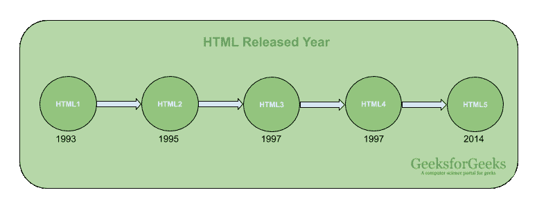

# HTML 简介

> 原文:[https://www.geeksforgeeks.org/html-introduction/](https://www.geeksforgeeks.org/html-introduction/)

**HTML** 代表超文本标记语言。它用于使用标记语言设计网页。HTML 是超文本和标记语言的结合。超文本定义了网页之间的链接。标记语言用于在定义网页结构的标签中定义文本文档。这种语言用于注释(为计算机做笔记)文本，以便机器能够理解它并相应地操作文本。大多数标记语言(如超文本标记语言)是人类可读的。该语言使用标签来定义需要对文本进行什么操作。

HTML 是浏览器用来操作文本、图像和其他内容的标记语言，以便以所需的格式显示。HTML 是蒂姆·伯纳斯·李在 1991 年创建的。HTML 的第一个版本是 HTML 1.0，但第一个标准版本是 1999 年发布的 HTML 2.0。



**元素和标签:** HTML 使用预定义的[标签](https://www.geeksforgeeks.org/html-html-tag/#:~:text=The%20tag%20in%20HTML,DOCTYPE%3E%20tag.)和[元素](https://www.geeksforgeeks.org/html-elements/)，告诉浏览器如何正确显示内容。记住要包含结束标签。如果省略，浏览器将应用开始标记的效果，直到页面结束。


**HTML 页面结构:**一个 HTML 页面的基本结构布局如下。它包含创建所有网页的基本构件元素(即文档类型声明、HTML、标题、标题和正文元素)。


[**< DOCTYPE！html >**](https://www.geeksforgeeks.org/html-doctypes/) **:** 这是文档类型声明(技术上不是标签)。它将文档声明为 HTML 文档。doctype 声明不区分大小写。

[**<html>**](https://www.geeksforgeeks.org/html-html-tag/)**:**这叫做 HTML 根元素。所有其他元素都包含在其中。

[**<头像>**](https://www.geeksforgeeks.org/html-head-tag/#:~:text=The%20tag%20in%20HTML,head%3E%20element%20can%20be%20omitted.) **:** 头像标签包含一个网页的“幕后”元素。标题中的元素在网页前端不可见。<头部>元素内部使用的 HTML 元素包括:

*   [<风格>](https://www.geeksforgeeks.org/html-style-tag/)
*   [<称号>](https://www.geeksforgeeks.org/html-title-tag/)
*   [T2>基地](https://www.geeksforgeeks.org/html-base-tag/)
*   <【no script】>
*   [<剧本>](https://www.geeksforgeeks.org/html-script-tag/)
*   [< 当 >](https://www.geeksforgeeks.org/html-meta-tag/#:~:text=The%20tag%20in%20HTML,keywords%2C%20document%20author%2C%20etc.)
*   [<链接>](https://www.geeksforgeeks.org/html-link-tag/)

[**<body>**](https://www.geeksforgeeks.org/html-body-tag/#:~:text=The%20tag%20in%20HTML,well%20as%20an%20ending%20tag.)**:**body 标签用于封装网页的所有可见内容。换句话说，正文内容就是浏览器将在前端显示的内容。

可以使用任何文本编辑器创建一个 HTML 文档。使用**保存文本文件。html** 或**。htm** 。一旦保存为 HTML 文档，该文件就可以在浏览器中作为网页打开。

**注**:基本/内置文本编辑器有记事本(Windows)和文本编辑(Macs)。基本的文本编辑器对于刚入门的人来说已经足够了。随着您的进步，有许多功能丰富的文本编辑器可供使用，允许更大的功能和灵活性。

**示例**:这个示例说明了 HTML 代码的基本结构。

## 超文本标记语言

```html
<!DOCTYPE html>
<html>
<head>
    <title>Demo Web Page</title>
</head>

<body>
    <h1>GeeksforGeeks</h1>

<p>A computer science portal for geeks</p>

</body>
</html>
```

**输出:**


**HTML 的特点:**

*   它易学易用。
*   它与平台无关。
*   图像、视频和音频可以添加到网页中。
*   超文本可以添加到文本中。
*   它是一种标记语言。

**为什么要学 HTML？**

*   这是一种简单的标记语言。它的实现很容易。
*   它用于创建网站。
*   帮助开发网络编程的基础知识。
*   提升职业生涯。

**优势:**

*   HTML 用于建立网站。
*   所有浏览器都支持它。
*   它可以与其他语言如 CSS、JavaScript 等进行集成。

**缺点:**

*   HTML 只能创建静态网页。对于动态网页，必须使用其他语言。
*   创建一个简单的网页需要编写大量的代码。
*   安全功能不好。

**注意:【HTML 基础请通过[https://www.geeksforgeeks.org/html-basics/](https://www.geeksforgeeks.org/html-basics/)了解。**

HTML 是网页的基础，通过构建网站和网络应用程序用于网页开发。您可以通过以下 [HTML 教程](https://www.geeksforgeeks.org/html-tutorials/)和 [HTML 示例](https://www.geeksforgeeks.org/html-examples/)从头开始学习 HTML。