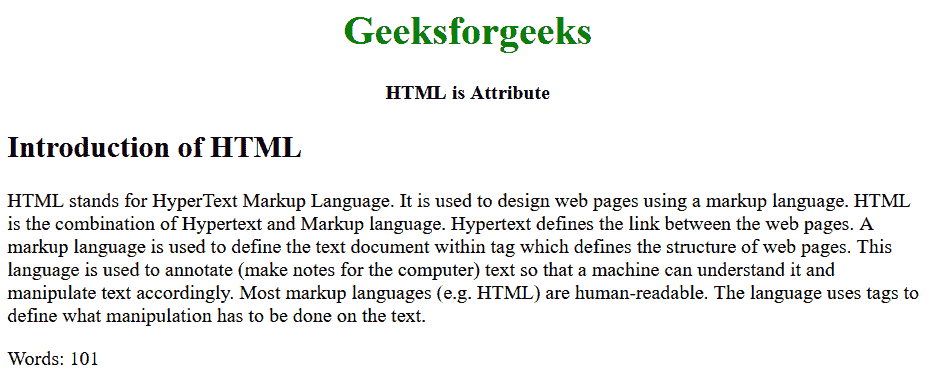

# HTML 是属性

> 原文:[https://www.geeksforgeeks.org/html-is-attribute/](https://www.geeksforgeeks.org/html-is-attribute/)

HTML“is”是一个全局属性，它允许您指定标准的 HTML 元素应该表现得像一个已定义的自定义内置元素。这意味着只有在文档中成功定义了指定的自定义元素名称时，才能使用该属性。
**语法:**

```html
<*tag* is="word-count"></*tag*>
```

这里，****标签**可以是任何 HTML 标签。**

****示例:**下面的示例将说明 is 属性是 HTML**

## **超文本标记语言**

```html
<!DOCTYPE html>
<html>

<body>
    <center>
        <h1 style="color: green">Geeksforgeeks</h1>
        <strong>HTML is Attribute</strong>
    </center>

    <article contenteditable="">
        <h2>Introduction of HTML</h2>

        <p>
            HTML stands for HyperText Markup Language.
            It is used to design web pages using a markup
            language. HTML is the combination of Hypertext
            and Markup language. Hypertext defines the link
            between the web pages. A markup language is used
            to define the text document within tag which defines
            the structure of web pages. This language is used to
            annotate (make notes for the computer) text so that
            a machine can understand it and manipulate text accordingly.
            Most markup languages (e.g. HTML) are human-readable.
            The language uses tags to define what manipulation has
            to be done on the text.
        </p>

        <p is="word-count"></p>
    </article>

    <script>
        class WordCount extends HTMLParagraphElement {
            constructor() {
                super();

                const wcParent = this.parentNode;

                function countWords(node) {
                    const text = node.innerText || node.textContent;
                    return text.split(/\s+/g).length;
                }

                const count = `Words: ${countWords(wcParent)}`;

                const shadow = this.attachShadow({ mode: 'open' });

                const text = document.createElement('span');
                text.textContent = count;

                shadow.appendChild(text);
                setInterval(function () {
                    const count = `Words: ${countWords(wcParent)}`;
                    text.textContent = count;
                }, 200);
            }
        }

        customElements.define('word-count',
            WordCount, { extends: 'p' });
    </script>
</body>

</html>
```

****输出:****

****

****支持的浏览器:****

*   **谷歌 Chrome**
*   **火狐浏览器**
*   **旅行队**
*   **歌剧**