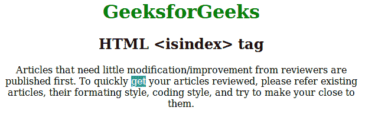

# HTML |

<form>

* * *

<label>This is a searchable index. Enter search keywords: <input name="isindex"></label>

* * *

</form>

标签

> 哎哎哎:# t0]https://www . geeksforgeeks . org/html-isiindex 标签/

**<是索引>** 标记，用于通过文本字段查询任何文档。意味着该标签通知浏览器用户想要通过文档提供搜索功能。如果你想在一篇长文章中搜索任何特定的词，这个标签是有帮助的。但是在这些日子里，所有的浏览器都包含这个特性，按下 CTRL + F 可以让你搜索这个单词，所以这个标签现在不再有用了。

**语法:**

```html
<isindex prompt="search">
```

**属性:**

*   **提示:**该属性包含一个字符串，该字符串是文本字段的标签。
*   **动作:**当需要将查询发送到不同的 URL 时，该属性保存 URL。

**注意:** HTML5 不支持 **< isindex >** 标签。

**示例:**

## 超文本标记语言

```html
<!Doctype html>
<html>

<head>
    <title>HTML isindex Tag</title>
    <isindex prompt="Search" />
    <style>
        h1 {
            color: green;
        }
    </style>
</head>

<body>
    <center>
        <h1>GeeksforGeeks</h1>
        <h2>HTML <isindex> tag</h2>

<p>
            Articles that need little modification/improvement
        from reviewers are published first. To quickly get your
        articles reviewed, please refer existing articles,
        their formating style, coding style, and try to make
        your close to them.
        </p>

    </center>
</body>

</html>                   
```

**输出:** **得到**字被搜索，



**支持的浏览器:**以下列出了 **HTML | < isindex >标签**支持的浏览器:

*   谷歌 Chrome
*   微软公司出品的 web 浏览器
*   火狐浏览器
*   旅行队
*   歌剧