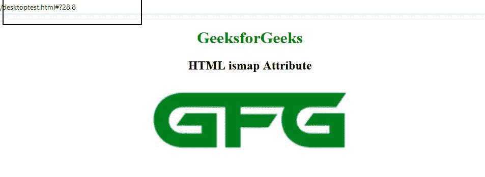

# HTML | ismap 属性

> 原文:[https://www.geeksforgeeks.org/html-ismap-attribute/](https://www.geeksforgeeks.org/html-ismap-attribute/)

**HTML ismap 属性**是一个布尔属性。当存在时，它指定图像是服务器端图像映射的组成元素(图像映射是具有可点击区域的图片)。
当点击服务器端的图像地图时，印刷机坐标的平方度量作为 URL 查询字符串发送到服务器

**适用于:**

*   **[](https://www.geeksforgeeks.org/html-img-ismap-attribute/?ref=rp)T3】**

**语法:**

```html

```

**示例:**

```html
<!DOCTYPE html>
<html>

<body>
    <center>
        <h1 style="color:green">
            GeeksforGeeks
        </h1>
        <h2>HTML ismap Attribute</h2>
    <a href="#">
        
    </a>
    </center>
</body>

</html>
```

**输出:**
**前:**

**后点击图像:**


支持的浏览器: **HTML 最大属性**支持的浏览器如下:

*   谷歌 Chrome
*   歌剧
*   旅行队
*   火狐浏览器
*   微软公司出品的 web 浏览器