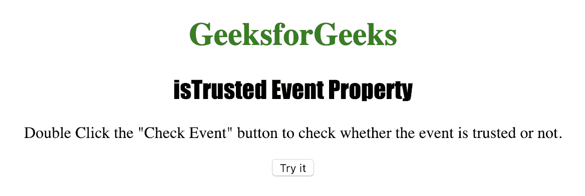
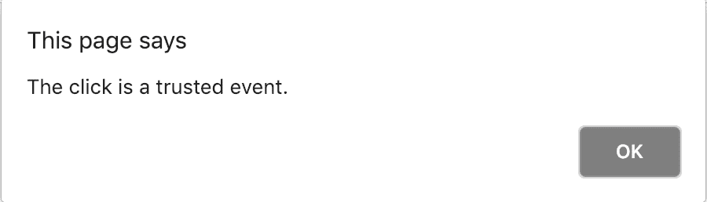

# HTML |受调整的事件属性

> 原文:[https://www . geesforgeks . org/html-istusted-event-property/](https://www.geeksforgeeks.org/html-istrusted-event-property/)

**是受信任的事件**属性用于检查事件是否可信。

**返回值:**返回*真*如果事件可信，则返回*假*。

**语法:**

```html
event.isTrusted
```

下面的程序说明了 isTrusted 事件属性:

**示例:**了解特定事件是否可信。

```html
<!DOCTYPE html>
<html>

<head>
    <title>isTrusted Event Property in HTML</title>
    <style>
        h1 {
            color: green;
        }

        h2 {
            font-family: Impact;
        }

        body {
            text-align: center;
        }
    </style>
</head>

<body onclick="MyEvent(event)">

    <h1>GeeksforGeeks</h1>
    <h2>isTrusted Event Property</h2>

    <p>Double Click the "Check Event"
       button to check whether the event 
       is trusted or not.</p>

    <button ondblclick="MyEvent(event)">
      Try it
    </button>

    <script>
        // Check whether the event is trusted or not.
        function MyEvent(event) {
            if ("isTrusted" in event) {
                if (event.isTrusted) {
                    alert("The " + event.type + 
                    " is a trusted event.");
                } else {
                    alert("The " + event.type + 
                    " is not a trusted event.");
                }
            } else {
                alert("Your browser does not support "
                       +"the isTrusted property");
            }
        }
    </script>

</body>

</html>
```

**输出:**
**点击按钮前:**


**点击按钮后:**


**支持的浏览器:**

*   歌剧
*   微软公司出品的 web 浏览器
*   谷歌 Chrome
*   火狐浏览器