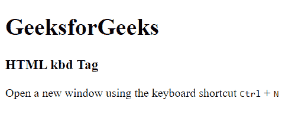
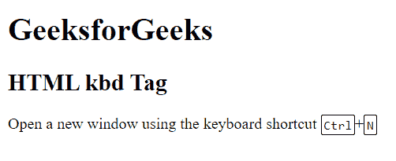

# HTML kbd Tag

> 原文:[https://www.geeksforgeeks.org/html-kbd-tag/](https://www.geeksforgeeks.org/html-kbd-tag/)

它是一个短语标签，用于定义键盘输入。包含在`标签中的文本通常以浏览器的默认等宽字体显示。`

**语法:**

```html
<kbd> text content ... </kbd>
```

**所有短语标签列表:**

*   [**< em >**](https://www.geeksforgeeks.org/html-em-tag/) **:用于强调文字。**
*   [**<强>**](https://www.geeksforgeeks.org/html-strong-tag/) **:** 它用来定义一个重要的文本。
*   [**<代码>**](https://www.geeksforgeeks.org/html-code-tag/) **:** 里面封装了电脑代码。
*   [**<samp>**](https://www.geeksforgeeks.org/html-samp-tag/)**:**它定义了一个来自计算机程序的输出文本样本。
*   [**< kbd >**](https://www.geeksforgeeks.org/html-kbd-tag/) **:它定义了键盘输入的文本。**
*   [**< var >**](https://www.geeksforgeeks.org/html-var-tag/) **:它定义了变量文本。**

**示例 1:** 该示例描述了< kbd >标签的使用。

## 超文本标记语言

```html
<!DOCTYPE html>
<html>

<body>
    <h1>GeeksforGeeks</h1>

    <h3>HTML kbd Tag</h3>

    <p>
        Open a new window using the 
        keyboard shortcut
        <kbd>Ctrl</kbd> + <kbd>N</kbd>
    </p>
</body>

</html>
```

**输出:**



**示例 2:** 本示例使用带有一些 CSS 样式的< kbd >标签。

## 超文本标记语言

```html
<!DOCTYPE html>
<html>

<head>
    <style>
        kbd {
            border-radius: 2px;
            padding: 2px;
            border: 1px solid black;
        }
    </style>
</head>

<body>
    <h1>GeeksforGeeks</h1>

    <h2>HTML kbd Tag</h2>

    <p>Open a new window using the 
        keyboard shortcut
        <kbd>Ctrl</kbd>+<kbd>N</kbd>
    </p>
</body>

</html>
```

**输出:**



**支持的浏览器:**

*   谷歌 Chrome
*   微软公司出品的 web 浏览器
*   火狐浏览器
*   旅行队
*   歌剧