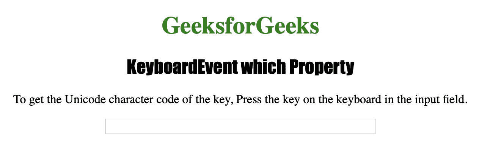
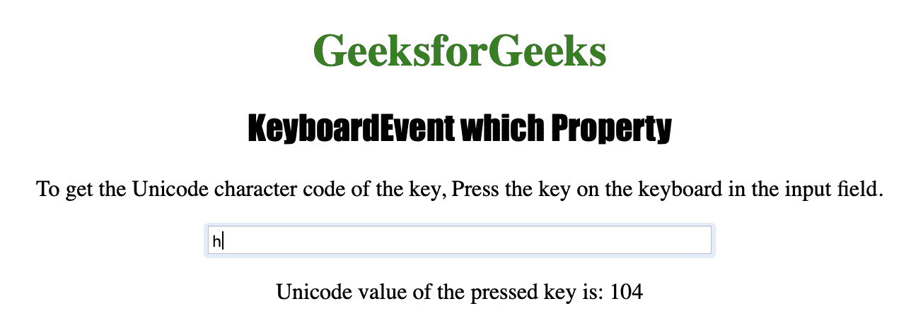

# HTML |键盘事件哪个属性

> 原文:[https://www . geeksforgeeks . org/html-keyboardevent-what-property/](https://www.geeksforgeeks.org/html-keyboardevent-which-property/)

**键盘事件，属性**用于返回触发*按键*事件的按键的 Unicode 字符代码。它还返回触发 *onkeydown* 或*onkeydown*事件的密钥的 Unicode 密钥代码。
键码是代表键盘上实际按键的数字，不同于代表 ASCII 字符的字符码。

**语法:**

```html
event.which
```

下面的程序说明了 KeyboardEvent 的哪个属性:
**示例:**返回键的 Unicode 字符代码。

```html
<!DOCTYPE html>
<html>

<head>
    <title>KeyboardEvent which Property in HTML</title>
    <style>
        h1 {
            color: green;
        }

        h2 {
            font-family: Impact;
        }

        body {
            text-align: center;
        }
    </style>
</head>

<body>

    <h1>GeeksforGeeks</h1>
    <h2>KeyboardEvent which Property</h2>

    <p> To get the Unicode character code of the key, 
      Press the key on the keyboard in the input field.</p>

    <input type="text" size="50" onkeypress="MyEvent(event)">

    <p id="test"></p>
    <!-- Script to return Unicode Value. -->
    <script>

        function MyEvent(event) {
            var e = event.which;
            document.getElementById("test").innerHTML = 
              "Unicode value of the pressed key is: " + e;
        }
    </script>

</body>

</html>
```

**输出:**


**点击**
按钮后

**支持的浏览器:**

*   歌剧
*   微软公司出品的 web 浏览器
*   谷歌 Chrome
*   火狐浏览器
*   苹果 Safari