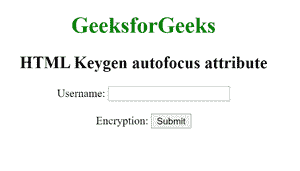

# HTML keygen 自动对焦属性

> 原文:[https://www . geesforgeks . org/html-keygen-autofocus-attribute/](https://www.geeksforgeeks.org/html-keygen-autofocus-attribute/)

**HTML <键根>自动对焦属性**用于指定页面加载时<键根>元素应该对焦。它是一个布尔属性。

**注意:**只支持以下元素:<按钮>、<输入>、<选择>和<文本区>

**语法:**

```html
<keygen autofocus>
```

**示例:**下面的示例说明了< keygen >元素的自动对焦属性。

## 超文本标记语言

```html
<!DOCTYPE html>
<html>

<body style="text-align: center;">
    <h1 style="color:green;">
        GeeksforGeeks
    </h1>

    <h2>HTML Keygen autofocus attribute</h2>

    <form>
        Username: <input type="text" name="uname">
        <br><br> Encryption: <keygen form="myGeeks"
                name="secure" autofocus>
        <input type="submit">
    </form>
</body>

</html>
```

**输出:**



**支持的浏览器:**

*   谷歌 Chrome 13.0
*   Opera 11.0
*   Safari 6.0
*   不支持 Internet Explorer
*   火狐不支持