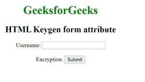

# HTML keygen 表单属性

> 原文:[https://www.geeksforgeeks.org/html-keygen-form-attribute/](https://www.geeksforgeeks.org/html-keygen-form-attribute/)

[HTML < keygen >](https://www.geeksforgeeks.org/html-keygen-tag/) 表单属性用于指定< keygen >元素所属的一个或多个表单。

**语法:**

```html
<keygen form="form_id">
```

**属性值:**包含单个值 **form_id** ，指定 Keygen 元素所属的一个或多个表单。该属性的值应该是<表单>元素的 id。**示例代码:**下面的代码说明了 HTML < keygen >表单属性。

## 超文本标记语言

```html
<!DOCTYPE html>
<html>

<body>
    <h1 style="color:green;">
        GeeksforGeeks
    </h1>

    <h2>HTML Keygen form attribute</h2>

    <form id = "myGeeks">
        Username: <input type="text" name="uname">
        <br><br> Encryption:
        <keygen form="myGeeks" name="secure">
        <input type="submit">
    </form>
</body>

</html>
```

**输出:**



**支持的浏览器:**

*   苹果 Safari 1.0
*   谷歌 Chrome 1.0
*   Firefox 1.0
*   Opera 1.0