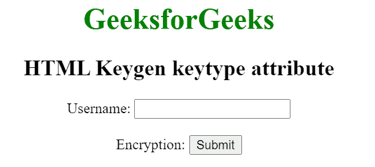

# HTML keygen 按键类型属性

> 原文:[https://www . geesforgeks . org/html-key gen-key type-attribute/](https://www.geeksforgeeks.org/html-keygen-keytype-attribute/)

[**HTML<key gen>**](https://www.geeksforgeeks.org/html-keygen-tag/)*****key type*****属性用于定义将要使用的密钥类型。基本上，该属性用于保护表单数据。****

******注意:**不同浏览器的按键类型可能不同。****

******语法:******

```html
**<keygen keytype="rsa|dsa|ec">**
```

******属性值:******

*   ******rsa:** 为默认值。它定义了一个 RSA 安全算法。它为用户提供了 RSA 关键优势的选择。****
*   ******dsa** :定义了一个 dsa 安全算法。它为用户提供了 DSA 密钥大小的选择。****
*   ******ec:** 定义了一个 ec 安全算法。它为用户提供了电子商务关键优势的选择。****

******示例:**下面的代码说明了 [<键根>](https://www.geeksforgeeks.org/html-keygen-tag/) 元素的*键型*属性。****

## ****超文本标记语言****

```html
**<!DOCTYPE html>
<html>

<head>
    <title>
        HTML keygen keytype attribute
    </title>
</head>

<body>
    <center>
        <h1 style="color:green;">
            GeeksforGeeks
        </h1>

        <h2>HTML Keygen keytype attribute</h2>

        <form>
            Username: <input type="text" name="uname">
            <br><br>
            Encryption: <keygen form="myGeeks" 
                keytype="rsa" name="secure" disabled>

            <input type="submit">
        </form>
      </center>
</body>

</html>**
```

******输出:******

********

******支持的浏览器:******

*   ****谷歌 Chrome****
*   ****火狐浏览器****
*   ****歌剧****