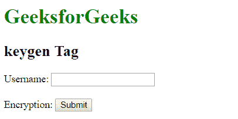

# HTML | keygen Tag

> 哎哎哎:# t0]https://www . geeksforgeeks . org/html-keygen 标签/

HTML 中的<keygen>标记用于指定表单中的密钥对生成器字段。<keygen>元素的目的是提供一种安全的方式来认证用户。当提交一个 from 时，会生成两个密钥，私钥和公钥。私钥存储在本地，公钥发送到服务器。公钥用于生成客户端证书，以便将来对用户进行身份验证。

**语法:**

```html
<keygen name = "name">
```

**示例:**

```html
<!DOCTYPE html>
<html>
    <head>
        <title>
            HTML keygen tag
        </title>
    </head>

    <body>
        <h1 style = "color:green;">
            GeeksforGeeks
        </h1> 

        <h2>Keygen Tag</h2> 

        <form>
            Username: <input type="text" name="uname">
            <br><br>
            Encryption: <keygen name="secure">
            <input type="submit">
        </form>
    </body>
</html>                    
```

**输出:**


**支持的浏览器:**以下列出了< keygen >标签支持的浏览器:

*   谷歌 Chrome
*   火狐浏览器
*   旅行队
*   歌剧