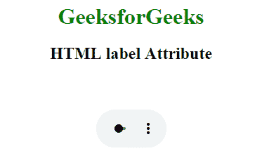

# HTML |标签属性

> 原文:[https://www.geeksforgeeks.org/html-label-attribute/](https://www.geeksforgeeks.org/html-label-attribute/)

**HTML 标签属性**用于指定文本轨道的标题。当列出可用的文本轨道时，浏览器使用文本轨道的标题。用于<轨道>元素。

**语法:**

```html
<track label="English"> 
```

支持的标签:

*   <track>

**示例:**

## 超文本标记语言

```html
<!DOCTYPE html>
<html>

<head>
    <style>
        body {
            text-align: center;
        }

        h1 {
            color: green;
        }
    </style>
</head>

<body>
    <h1>GeeksforGeeks</h1>
    <h2>HTML  label Attribute</h2>

    <video width="100"
           height="100"
           controls>

        <track src=
"https://write.geeksforgeeks.org/wp-content/uploads/11.mp4"
               id="myTrack1"
               kind="subtitles"
               srclang="en"
               label="English"
               default>

            <source id="myTrack"
                    src=
"https://write.geeksforgeeks.org/wp-content/uploads/11.mp4"
                    type="video/mp4">

    </video>
</body>

</html>
```

**输出:**



**支持的浏览器:**标签属性支持的浏览器如下:

*   谷歌 Chrome 18.0
*   Internet Explorer 10.0
*   Firefox 31.0
*   苹果 Safari 6.0
*   Opera 15.0