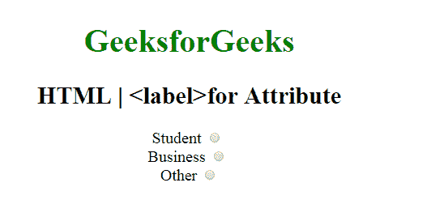

# 属性

的 HTML <label>> 原文:[https://www.geeksforgeeks.org/html-label-for-attribute/](https://www.geeksforgeeks.org/html-label-for-attribute/)

属性的 **HTML <标签>用于指定*标签绑定到的表单元素类型*。**

**语法:**

```html
<label for="element_id">
```

**属性值:**它包含值，即**元素 _id** ，指定标签绑定到的元素的 id。

**示例:**这个示例说明了在 **<标签>** 元素中 for 属性的使用。

```html
<!-- HTML code to illustrates label tag -->
<!DOCTYPE html>
<html>

<head>
    <title>
        HTML | for Attribute
    </title>

    <style>
        body {
            font-size: 20px;
        }
    </style>
</head>

<body style="text-align:center">

    <h1 style="color:green"> 
    GeeksforGeeks 
</h1>
    <h2>
      HTML | <label>for Attribute
  </h2>

    <form>

        <!-- Starts label tag from here -->
        <label for="student">
            Student
        </label>
        <input type="radio"
               name="Occupation"
               id="student"
               value="student">
        <br>

        <label for="business">
            Business
        </label>
        <input type="radio" 
               name="Occupation" 
               id="business" 
               value="business">
        <br>

        <label for="other">
            Other
        </label>
        <!-- Ends label tags here -->

        <input type="radio"
               name="Occupation"
               id="other"
               value="other">
    </form>
</body>

</html>
```

**输出:**


**支持的浏览器:**属性的 **HTML | <标签>支持的浏览器如下:**

*   谷歌 Chrome
*   微软公司出品的 web 浏览器
*   火狐浏览器
*   歌剧
*   旅行队</label>